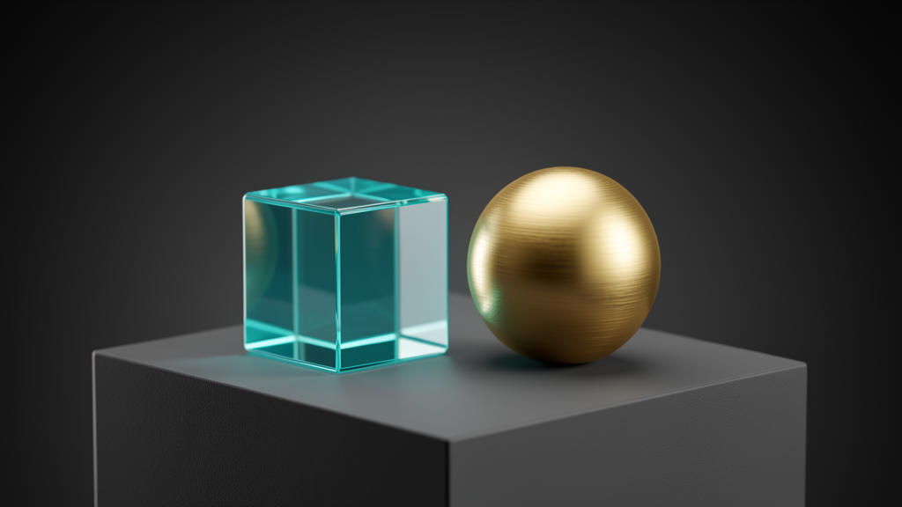
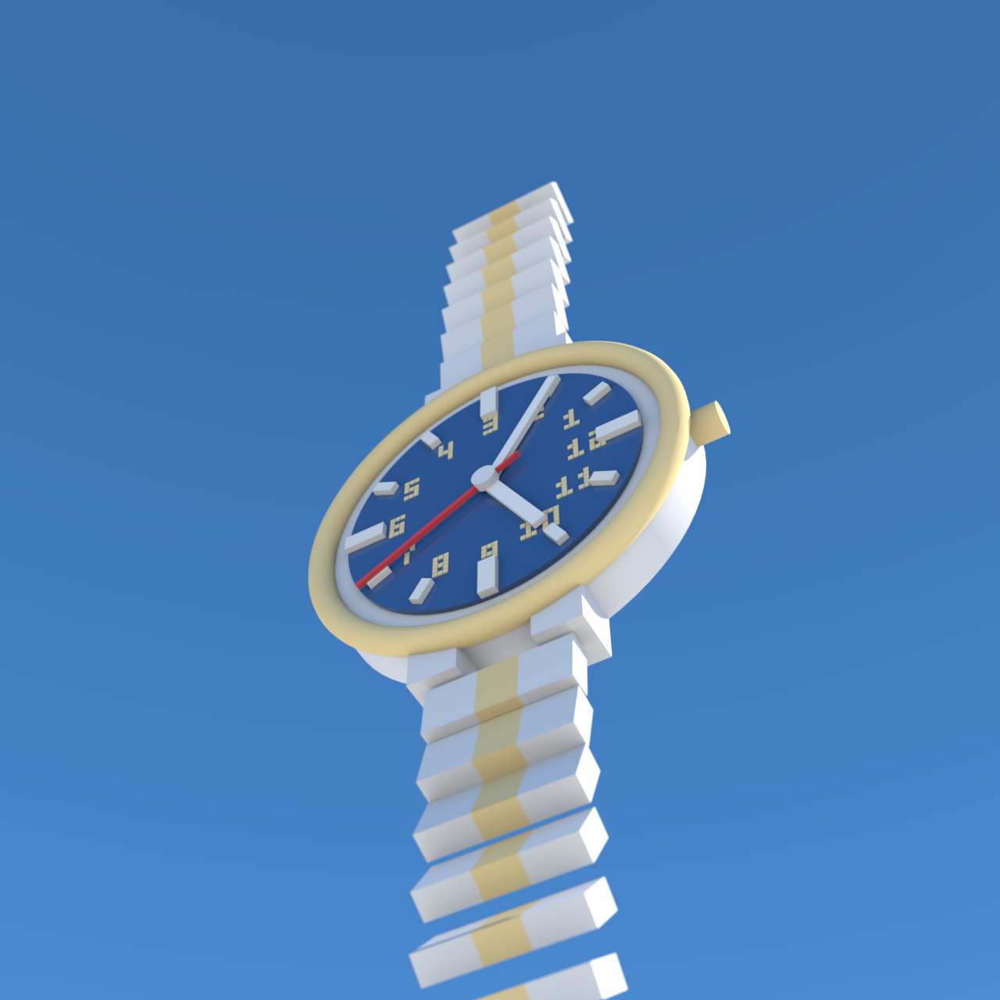
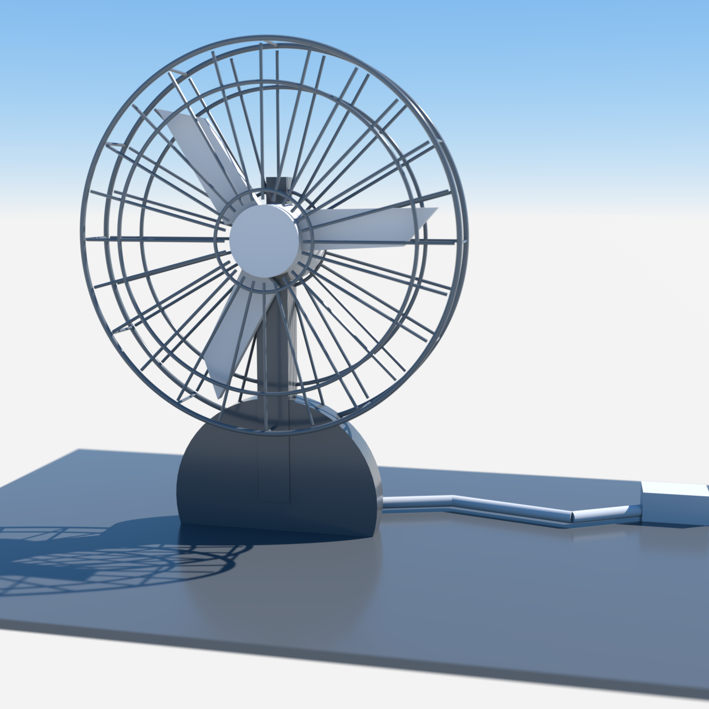
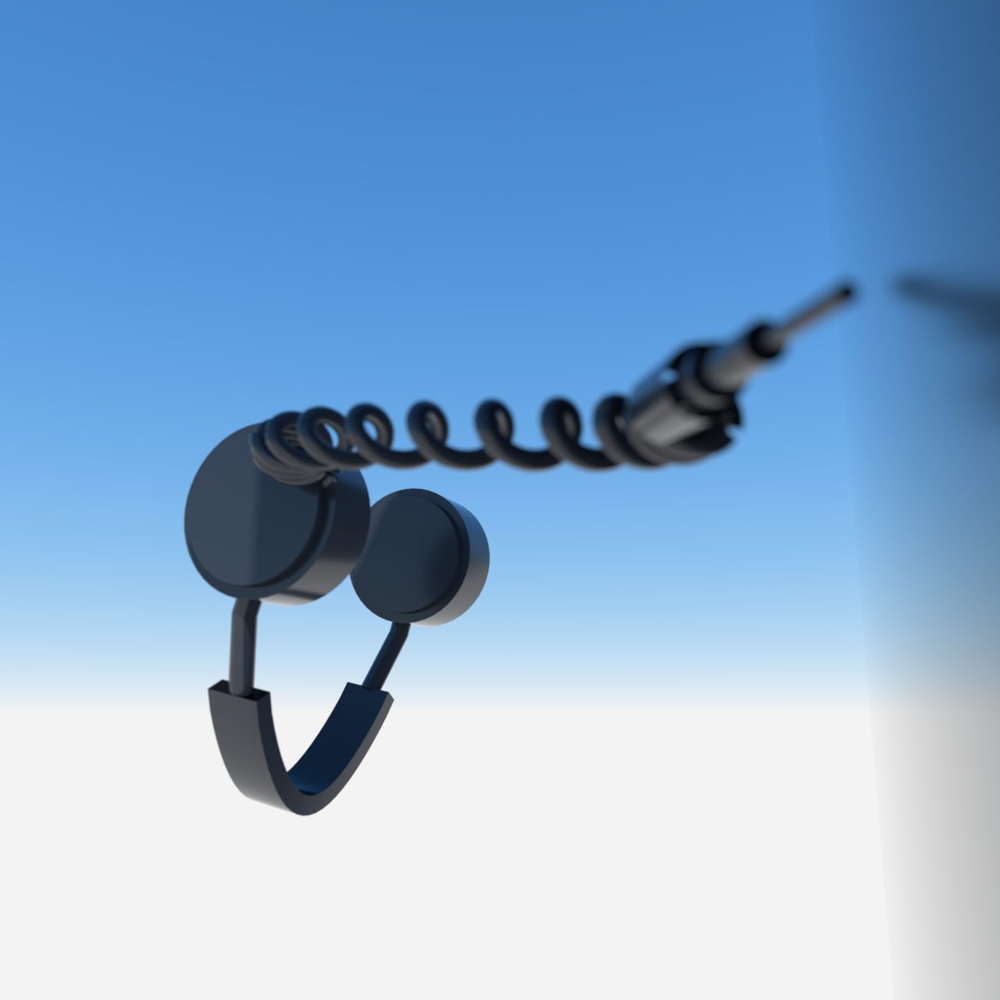
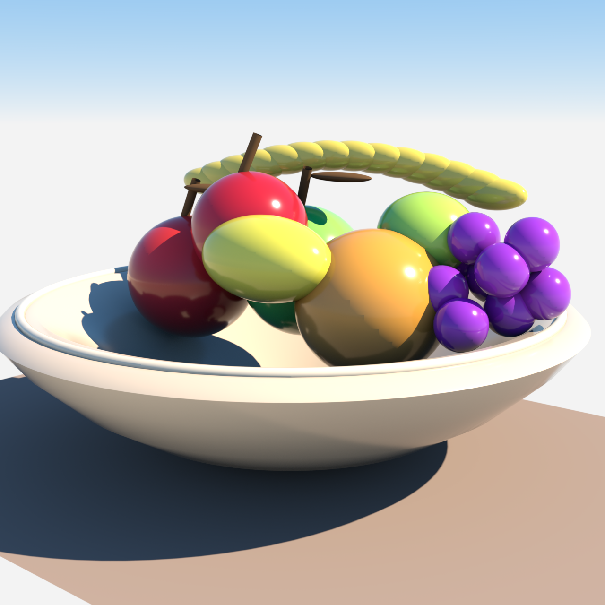
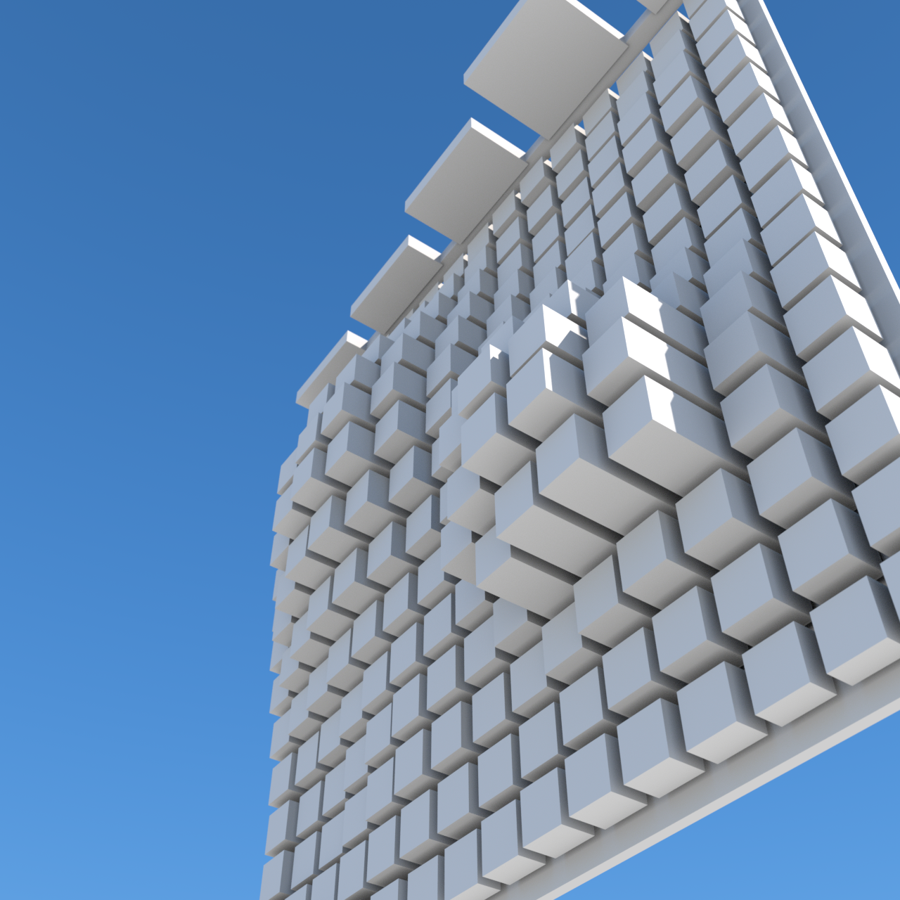
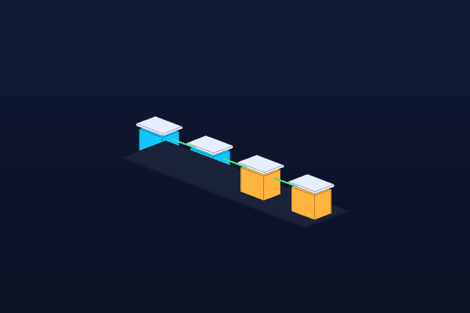
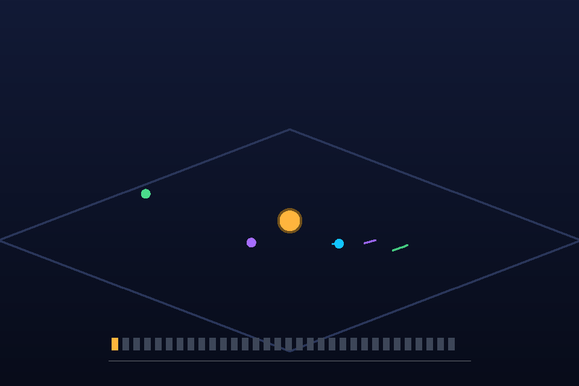

# OctaneX MCP

A local MCP server that lets Hermes Agent use **Octane X as a shared visual canvas** for geometry, data, math, and concept visualization.

## Licence

This repository uses a scoped licence structure. Read
[`LICENSE-SCOPE.md`](LICENSE-SCOPE.md) for the authoritative file and directory
boundaries.

- **Core source code** — [Business Source License 1.1](LICENSE). The BSL Core is
  source-available for non-production use and converts to Apache 2.0 on
  **2030-07-10**.
- **Agentic Canvas product** — [PolyForm Noncommercial 1.0.0](apps/octanex-canvas/LICENSE).
  The Canvas host, UI, WebGL renderer, and original package assets are free for
  noncommercial use; commercial deployment, SaaS, resale, and redistribution
  require a separate agreement.
- **Original knowledge and documentation** — [CC BY-SA 4.0](LICENSE-KNOWLEDGE.md).
  Methods, research framing, conceptual grammar specifications, and tutorials
  remain available in a reciprocal knowledge commons.
- **Data, corpus, and derived acceptance material** — [CC BY-NC-SA 4.0](LICENSE-DATA.md),
  subject to every upstream asset's own licence and attribution requirements.

Commercial licensing, trademark reservation, and upstream third-party
attributions are covered in [COMMERCIAL-TERMS.md](COMMERCIAL-TERMS.md) and
[NOTICE](NOTICE).

```text
Hermes MCP tool call -> Python MCP server -> JSON command queue -> Octane Lua bridge -> Octane X viewport/render target
```

The bridge intentionally avoids arbitrary Lua execution. The MCP server emits a small allowlisted command DSL, and the Octane-side Lua bridge validates and processes those commands inside Octane X.

## Example visual products

### Photoreal product studio



The recipe library starts with copyable visual targets, not just prose. The headline example above is a photoreal/PBR product-studio setup with glass, metal, softbox reflections, camera intent, material notes, and a native-render validation checklist. See [`examples/recipes/photoreal-product-studio/`](examples/recipes/photoreal-product-studio/) for the reusable OBJ/MTL scene and MCP command metadata.

### More recipe previews

The library now spans photoreal product props, space scenes, data/math visuals, and agent-loop demos. A sample of recent, native-verified recipes:

| Wristwatch | Desk fan | Headphones studio |
| --- | --- | --- |
| [](examples/recipes/wristwatch/) | [](examples/recipes/desk-fan/) | [](examples/recipes/headphones-studio/) |
| Two-tone steel/gold case, blue dial, gold numerals, sphere hour markers, linked bracelet. | Native Octane desk-fan prop with tubular cage, cord, plug, and prongs. | Opposing cylindrical cups, spiral path-following cord, multi-material binding. |

| Ancient temple | Bowl of fruit | Photoreal vase studio |
| --- | --- | --- |
| [](examples/recipes/ancient-temple/) | [](examples/recipes/bowl-of-fruit/) | [](examples/recipes/photoreal-vase-studio/) |
| Columned structure with proper lighting and bounds-aware framing. | Generated fruit cluster on a reflective surface. | Multi-vase photoreal studio with soft lighting. |

| Photoreal Earth | Saturn and moons | Data bars |
| --- | --- | --- |
| [](examples/recipes/photoreal-earth-space/) | [](examples/recipes/saturn-moons-space/) | [](examples/recipes/data-bars/) |
| Space rendering target with clouds, atmosphere, and sunlight. | Ringed-planet target with moons, bands, and Cassini division. | Fast generated chart geometry for numeric comparisons. |

| Math surface | Architecture flow | Animated orbit reveal |
| --- | --- | --- |
| [](examples/recipes/math-surface/) | [](examples/recipes/architecture-flow/) | [](examples/animations/orbit-reveal/) |
| Damped radial surface for mathematical explanation. | Explain command flow as spatial geometry. | GIF/MP4 frame-sequence pattern for animated products. |

| Wave interference | Vision feedback loop | Green pawn |
| --- | --- | --- |
| [](examples/recipes/wave-interference-field/) | [](examples/recipes/vision-feedback-loop/) | [](examples/recipes/green-pawn/) |
| Two-source wave field with highlighted emitters. | Agent loop from scene queue to PNG preview to local vision review. | Native Octane chess-pawn prop with material per group. |

See [`docs/recipe-library.md`](docs/recipe-library.md) for the full catalogue (30+ recipes) with reusable OBJ/MTL scenes and MCP command metadata.

## What this is for

Use this project when an agent needs to turn an explanation into a rendered scene:

- data as 3D bar charts or future chart grammars;
- math as surfaces and geometric objects;
- concepts as simple staged scenes;
- Hermes' avatar as a visual guide inside a render;
- quick render/preview/review loops for local visual R&D.

The documentation is written for rapid agentic learning, including smaller local models: start with the workflow cards below, then copy the exact examples.

## Current status

Verified or implemented:

- `octanex-mcp` stdio MCP server.
- Hermes MCP config pattern for `mcp_servers.octanex`.
- Octane X sandbox/container workspace path.
- Ordered JSON command queue plus `inbox.json` compatibility fallback.
- Versioned typed command schema, structured validation error codes, queue validation, `processing/` state, and per-command result JSON files.
- One-shot Lua bridge that drains `queue/*.json` and exits.
- Persistent Lua bridge window with manual `Process next` / `Drain queue` controls and timer fallback notes.
- On-demand bridge control helpers: status checks plus AppleScript-backed one-shot/persistent script launch attempts for macOS workflows.
- Parity tests keep one-shot and persistent scene-command handlers semantically aligned; they should differ only in scheduling/UI behavior.
- Scene operations: import mesh, create material, assign material, set camera, set lighting, start/restart render, save preview.
- Visual tools: bar chart, math surface, Hermes avatar face.
- Generated visual assets include bounds metadata and use bounds-aware camera placement for more reliable framing.
- Visual iteration protocol for target-matching recipes: native Octane preview evidence, local `qwen3-vl:2b` (or `glm-ocr`) review, bounded patch plans, and bundled final render/assets.
- Self-improving recipe book tools: agents can read and append successes, failures, partials, and pitfalls.

Known constraints:

- Octane X is sandboxed on macOS. Hermes must write to the real app-container path, not the apparent `~/OctaneMCP` path.
- Persistent Lua UI can block Octane's viewport refresh. Prefer one-shot queue draining for batches when the viewport looks stale.
- The core Python package stays lightweight: only `mcp` is required. Heavier geometry/science packages should be optional.

## Install and run

From this repo:

```bash
uv sync
PYTHONPATH= uv run octanex-mcp init
PYTHONPATH= uv run octanex-mcp doctor
PYTHONPATH= uv run octanex-mcp --self-test
```

Hermes config in `~/.hermes/config.yaml` (merge into the existing `mcp_servers` key):

```yaml
mcp_servers:
  octanex:
    # Use the bundled launcher, NOT bare `uv run` — it strips the Hermes
    # runtime PYTHONPATH so the server uses its own .venv (with
    # mcp/pydantic_core) instead of Hermes' broken one, which would crash
    # the server on import.
    command: "/path/to/octanex-mcp/run_octanex_mcp.sh"
    args: []
    timeout: 180
    connect_timeout: 30
    # Only if your workspace/app paths differ from the defaults the server
    # resolves. Hermes strips unlisted env vars from the subprocess, so any
    # custom path MUST be declared here explicitly.
    # env:
    #   OCTANEX_MCP_WORKSPACE: "/Users/craig/Library/Containers/com.otoy.rndrviewer/Data/OctaneMCP"
    #   OCTANEX_APP_PATH: "/Applications/Octane X.app"
```

For another checkout location, point `command` at that checkout's `run_octanex_mcp.sh` (the `--project` path is baked into the launcher), or set `OCTANEX_MCP_REPO` before running the server.

MCP servers are discovered at Hermes startup; restart Hermes (or use `/reload-mcp` in-session) after config changes, then verify:

```bash
hermes mcp list       # shows `octanex` (✓ enabled)
hermes mcp test octanex
```

## Workspace paths

By default, Hermes writes to the real Octane X sandbox container path for the current macOS user:

```text
~/Library/Containers/com.otoy.rndrviewer/Data/OctaneMCP/
```

Octane Lua may appear to use this path in scripts:

```text
~/OctaneMCP/
```

For reliability, generated scripts use the real container path directly. Override paths with environment variables when needed:

```bash
export OCTANEX_MCP_WORKSPACE="$HOME/Library/Containers/com.otoy.rndrviewer/Data/OctaneMCP"
export OCTANEX_MCP_REPO="/path/to/octane-mcp"
export OCTANEX_APP_PATH="/Applications/Octane X.app"
PYTHONPATH= uv run octanex-mcp init
PYTHONPATH= uv run octanex-mcp doctor
```

`octanex-mcp init` creates the workspace folders, writes `octanex-mcp.config.json` in the workspace, writes `octane_lua/config.generated.lua`, and generates portable bridge copies with the resolved workspace path injected. See [`docs/octane-bridge.md`](docs/octane-bridge.md) for bridge lifecycle and parity rules.

## Required Octane X Preferences setup

Octane X must be told where to find the Octane MCP Lua bridge scripts. After running `octanex-mcp init`, open Octane X and set the Lua scripts directory:

1. Open **Octane X**.
2. Open **Preferences**.
3. Find the **Scripts path** setting.
4. Set **Scripts path** to this checkout's Lua script directory:

```text
/path/to/octane-mcp/octane_lua
```

For this repository checkout, that is the `octane_lua/` folder containing:

```text
hermes_bridge_oneshot.generated.lua
hermes_bridge_persistent.generated.lua
```

If `OCTANEX_MCP_REPO` points somewhere else, use `$OCTANEX_MCP_REPO/octane_lua`. Restart Octane X after changing this preference if the scripts do not appear immediately.

Important files:

```text
.../OctaneMCP/inbox.json          latest command fallback
.../OctaneMCP/queue/*.json        ordered command queue
.../OctaneMCP/processing/*.json   command currently being handled
.../OctaneMCP/processed/*.json    successful processed commands
.../OctaneMCP/failed/*.json       failed command payloads
.../OctaneMCP/results/*.json      per-command success/error/result metadata
.../OctaneMCP/artifacts/          generated non-OBJ/preview artifacts
.../OctaneMCP/assets/             generated OBJ assets
.../OctaneMCP/renders/            preview/render outputs
.../OctaneMCP/scenes/             saved semantic scene manifests
.../OctaneMCP/status.json         bridge status/heartbeat
.../OctaneMCP/bridge.log          bridge log
```

## Octane-side bridge scripts

### Preferred batch fallback: one-shot bridge

Open Octane X and run:

```text
/path/to/octane-mcp/octane_lua/hermes_bridge_oneshot.generated.lua
```

This drains all ordered `queue/*.json` commands and exits so Octane's viewport/render loop can repaint. It also falls back to `inbox.json` for older single-command workflows.

### Persistent bridge window

Open Octane X and run:

```text
/path/to/octane-mcp/octane_lua/hermes_bridge_persistent.generated.lua
```

Leave the `Hermes Octane MCP Bridge` window open while using Hermes. If the timer mode is unavailable, use `Process next` for one command or `Drain queue` for a batch. Do **not** add sleep loops to Octane Lua; they run on the UI thread and can freeze Octane X.

If the persistent bridge closes with status `released` after `start_render`, that is intentional: it gives Octane's renderer a chance to repaint.

## MCP tool catalogue

### Status and learning

| Tool | Purpose |
| --- | --- |
| `octane_status()` | App existence, queue, processed/failed files, bridge status. |
| `octane_bridge_process_status()` | Octane process state, generated bridge paths, script readiness, and bridge heartbeat age. |
| `octane_run_oneshot_bridge(dry_run, timeout_seconds)` | Run `hermes_bridge_oneshot.generated.lua` from Octane X's **Script** menu via AppleScript; one click drains the complete queue. |
| `octane_start_persistent_bridge(dry_run, timeout_seconds)` | Run `hermes_bridge_persistent.generated.lua` from Octane X's **Script** menu via AppleScript. |
| `octane_validate_command(command)` | Validate one JSON command envelope. |
| `octane_schema()` | Return supported command operations, limits, path rules, and examples. |
| `octane_validate_queue()` | Validate queued command files in the workspace. |
| `octane_recipe_book(limit_chars=12000)` | Read local field notes for successes, failures, and pitfalls. |
| `octane_record_recipe(title, outcome, context, steps, signals, follow_ups)` | Append a lesson to `docs/recipe-book.md`. |
| `octane_recipe_index()` | List checked-in recipe examples with normalized metadata and preview/native verification status. |
| `octane_load_recipe(slug)` | Load a recipe's command sequence and resolved asset paths by slug. |
| `octane_queue_recipe(slug, overrides=None)` | Queue a checked-in recipe command sequence by slug. |
| `octane_validate_recipe_library()` | Validate checked-in recipe files, metadata, previews, and command payloads. |

### Low-level scene commands

| Tool | Purpose |
| --- | --- |
| `octane_ping(message)` | Queue a bridge ping. |
| `octane_create_test_cube(name, size)` | Generate a cube OBJ and queue import. |
| `octane_import_geometry(path, name, format)` | Queue OBJ/USD/FBX/Alembic import. |
| `octane_create_material(name, kind, color, roughness, metallic, transmission, ior, opacity, clearcoat, anisotropy, emission, texture_path, normal_path)` | Queue material create/update with extended PBR fields (unsupported Octane pins are acked with a warning by the bridge). |
| `octane_assign_material(object_name, material_name)` | Queue material assignment. |
| `octane_set_camera(position, target, fov)` | Queue camera placement. |
| `octane_set_lighting(preset)` | Queue lighting preset. |
| `octane_create_light(name, light_type, intensity, position, direction, size, angle, hdr_path)` | Queue native light creation (`area_light`, `sun_light`, `point_light`, `spot_light`, `directional_light`, `environment`, `emissive`). |
| `octane_start_render(samples, width, height)` | Queue render restart and resolution update. |
| `octane_save_preview(path, width, height, samples, min_samples, timeout_seconds, quality, max_render_time)` | Queue render-ready PNG preview save. `quality` ∈ `fast`(6s render/10s wall; 500 s/px creator default)/`preview`(10s)/`standard`(30s)/`high`(60s)/`ultra`(120s)/`final`(unbounded, 600s wall cap) sets a convergence ceiling; raw `samples`/`min_samples`/`timeout_seconds`/`max_render_time` override the tier. On timeout the current frame is saved best-effort. |
| `octane_review_preview(path)` | Review saved PNG previews with metrics, diagnosis, likely causes, and recommended actions. |
| `octane_suggest_camera_fix(preview_review, asset_bounds)` | Suggest a camera patch from preview QA and asset bounds. |
| `octane_suggest_lighting_fix(preview_review)` | Suggest a lighting/render patch from preview QA. |

### Higher-level visual tools

| Tool | Purpose |
| --- | --- |
| `octane_visualize_bars(values, name)` | Build a 3D bar chart OBJ and queue a full scene. |
| `octane_visualize_surface(expression, name, x_min, x_max, y_min, y_max, steps)` | Build a restricted `z=f(x,y)` surface and queue a full scene. |
| `octane_visualize_scatter(points, name)` | Build a 3D scatter plot OBJ from xyz triples and queue a full scene. |
| `octane_show_avatar(name)` | Show Hermes' geometric avatar face. |
| `octane_build_scene(scene_plan)` | Save a semantic scene manifest and queue validated scene commands. |
| `octane_save_scene_manifest(scene_plan)` | Save a semantic scene manifest without queueing commands. |
| `octane_build_concept(prompt)` | Deterministic MVP concept scaffold. |

## Workflow cards for agents

### Card 1: Is the bridge alive?

1. Call `octane_status()`.
2. If `bridge_seen` is false, ask the user to run one of the Lua bridge scripts in Octane X.
3. If queue grows but processed does not, run the one-shot bridge.
4. Record any non-obvious fix with `octane_record_recipe(...)`.

### Card 2: Show a simple object

1. Call `octane_create_test_cube(name="agent_cube", size=1.0)`.
2. Call `octane_start_render(samples=128)` if needed, then `octane_save_preview()`.
3. In Octane X, run `hermes_bridge_oneshot.generated` from the **Script** menu once to drain the full pipeline.
5. Call `octane_review_preview()` and verify `ok=true` before claiming success.

### Card 3: Visualize data quickly

1. Call `octane_visualize_bars(values=[3, 1, 4, 1, 5], name="pi_digits")`.
2. Run/drain the Lua bridge in Octane X.
3. Save a preview.
4. Call `octane_review_preview()`; if it reports blank/clipped/low-contrast output, adjust the generator or camera and record the lesson.

### Card 4: Visualize a math surface

1. Call `octane_visualize_surface(expression="sin(r) / max(r, 0.25)", steps=36)`.
2. Drain the queue with the one-shot bridge.
3. Save/inspect preview.
4. Keep expressions restricted to `x`, `y`, `r`, `sin`, `cos`, `tan`, `sqrt`, `log`, `exp`, `pow`, `min`, `max`, `abs`, `pi`, and `e`.

### Card 5: Self-improve after use

After any successful, failed, or surprising run, append a concise recipe:

```text
octane_record_recipe(
  title="One-shot bridge fixed stale viewport after bar chart import",
  outcome="success",
  context="Persistent bridge processed queue but Octane viewport stayed stale.",
  steps=[
    "Queued octane_visualize_bars with five values.",
    "Ran hermes_bridge_oneshot.generated from Octane X's Script menu.",
    "Restarted render and saved preview."
  ],
  signals=["queue/ drained", "processed/ gained command files", "preview PNG existed"],
  follow_ups=["Prefer one-shot bridge for multi-command visual scenes"]
)
```

Keep entries small and operational. A future local model should be able to copy the pattern directly.

## Development smoke tests

```bash
cd /path/to/octane-mcp
PYTHONPATH= uv run octanex-mcp --self-test
PYTHONPATH= uv run python -m octanex_mcp.client_smoke
PYTHONPATH= uv run python -m compileall src
hermes mcp test octanex
```

`PYTHONPATH=` avoids accidentally importing packages from Hermes' own runtime venv when developing inside the Hermes desktop terminal.

## More docs

- `docs/agent-quickstart.md` — short examples designed for small/local models.
- `docs/recipe-library.md` — broad example scenes with reusable OBJ files, command metadata, and preview renders.
- `docs/recipe-book.md` — self-improving successes, failures, partials, and pitfalls.
- `docs/canvas-roadmap.md` — visual canvas roadmap.
- `docs/local-model-rich-moa.md` — local visual R&D process.

## Example recipe library

Reusable sample scenes live under `examples/recipes/`. Each recipe directory contains:

- `README.md` — prompt, purpose, steps, and variations;
- `scene.obj` — reusable geometry;
- `scene.json` — camera and MCP command sequence metadata;
- `preview.png` or `photoreal-preview.png` — preview/target render for quick review.

Start with `docs/recipe-library.md` when exploring applications beyond the built-in bars/surface/avatar tools.

Animated examples live under `examples/animations/`. The first example, `orbit-reveal`, includes a GitHub-friendly GIF, MP4, PNG frame sequence, OBJ frame states, and storyboard metadata. The current robust animation pattern is frame-by-frame scene generation plus `ffmpeg` encoding; native Octane timeline control can be added later.

---

## Links

- X / Twitter: [@nobulart](https://x.com/nobulart/)
- Support: [Buy me a coffee](https://buymeacoffee.com/nobulart)
