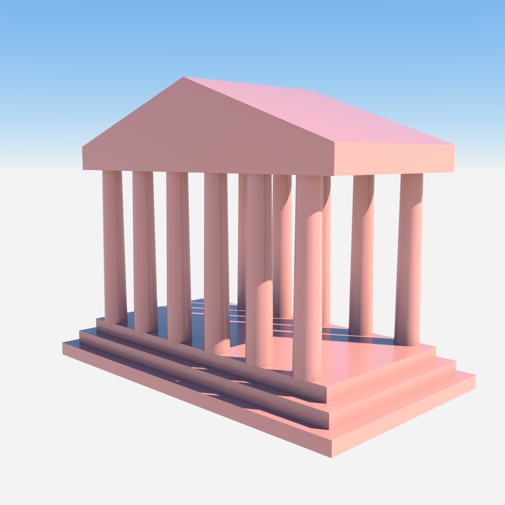

# Ancient Greek-Style Temple

- **Category:** Architecture
- **Purpose:** Render a simplified Doric temple (stepped platform, two colonnades of tapered columns, entablature, triangular pediment) bounding against plain sky, as a reusable architecture scene.
- **Starter prompt:** Visualise an ancient temple

## Files

- `scene.obj` — combined geometry (one mesh, 2 `usemtl` groups: `stone`, `roof`).
- `scene.mtl` — material color/roughness hints matching the OBJ `usemtl` names.
- `scene.json` — command sequence and camera metadata for agents.
- `octane-preview.png` — native Octane X render (beauty=5000, 96 spp).

## MCP tools to use

- `octane_load_recipe` (`ancient-temple`)
- `octane_queue_recipe` (`ancient-temple`) — flushes the queue, writes the 8 commands, drains via the one-shot bridge.
- `octane_save_preview`

## Steps

1. Queue the recipe: `octane_queue_recipe(slug="ancient-temple")`.
2. In Octane X → **Script → `hermes_bridge_oneshot.generated`** (one click drains the whole queue).
3. Inspect `octane-preview.png` for framing/contrast/material correctness.

## Notes

- **Proven-visible path:** one combined OBJ → one `NT_GEO_MESH` node; materials bound per `usemtl` **group** via `assign_material(group_index=1..2)`. Binding a material to the whole mesh does not faithfully colour a multi-material combined subject on this Octane build.
- **Generator:** `scripts/gen_temple_obj.py` is the single source of truth for `scene.obj` (3-tier stepped base, 12 tapered columns in a 6×2 grid, entablature block, triangular pediment prism). Regenerate with `python3 scripts/gen_temple_obj.py`.
- The temple renders against plain sky (no ground plane) — add a backplate/floor for a true environment look.
- The pediment is a simple triangular prism; under soft sky lighting it can read faint against the horizon. If it looks weak, deepen `mat_roof` (already set to a saturated terracotta) or add a ground/backplate for contrast.
- **Double-render on one-shot drain (observed 2026-07-12):** the bridge's `save_preview` handler starts the render and saves the frame; the script then performs a *top-level delayed RT re-activation* (`activated render target Hermes Render Target` → `top-level delayed restart ok=true`) after the queue drains. That restart re-warms the engine but does not re-emit `save_preview`, so the PNG is written once — the visible "second pass" is the bridge re-selecting/restarting the RT post-save, not a duplicate image write. No action needed; documented so the next agent does not mistake it for a queue duplication bug.

## Re-render in Octane

1. Import `scene.obj`: `octane_import_geometry(path="examples/recipes/ancient-temple/scene.obj", name="ancient_temple")`.
2. Apply the 2 materials + group assignments from `scene.json`, then camera/lighting/save_preview.
3. Drain via `octane_lua/hermes_bridge_oneshot.generated.lua`.
