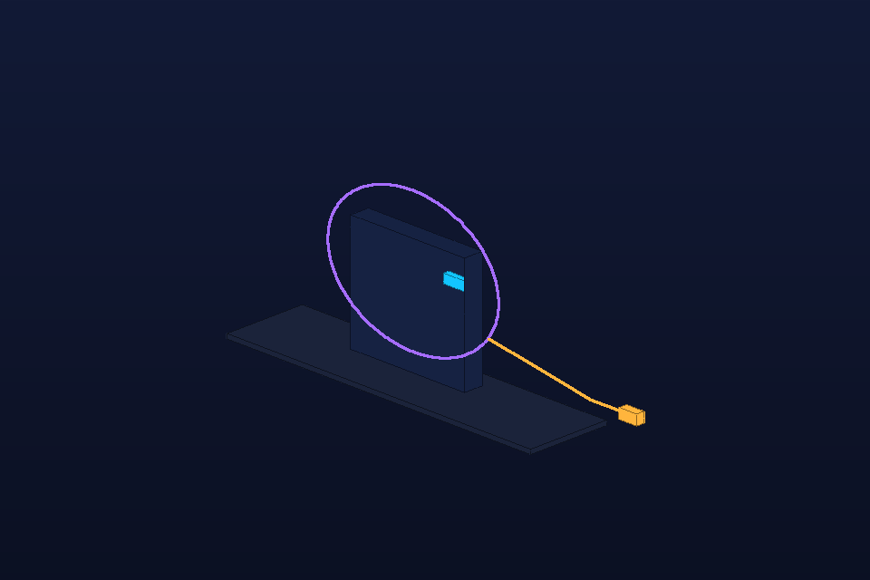

# Hermes Avatar Guide

- **Category:** Agent communication
- **Purpose:** Place a geometric Hermes guide in a scene with a pointer so agents can direct attention visually.
- **Starter prompt:** Render Hermes as a non-human guide pointing at an object or idea.

## Files

- `scene.obj` — reusable geometry scene.
- `scene.json` — command sequence and camera metadata for agents.
- `preview.png` — lightweight generated preview for quick review in GitHub/docs.

## MCP tools to use

- `octane_show_avatar`
- `octane_import_geometry`

## Steps

1. Call octane_show_avatar for the standard avatar.
2. Add target geometry and pointer/callout blocks.
3. Use color states: cyan helpful, gold insight, amber warning, red error.

## Variations to explore

- Add emotion-state variants.
- Use pointer geometry to highlight data points or errors.

## Re-render in Octane

1. Import `scene.obj` with `octane_import_geometry(path="examples/recipes/avatar-guide/scene.obj", name="avatar-guide")`.
2. Apply camera from `scene.json`.
3. Drain the queue with `octane_lua/hermes_bridge_oneshot_v2.lua`.
4. Save an Octane preview and replace/add it alongside `preview.png` if it teaches a useful lesson.
