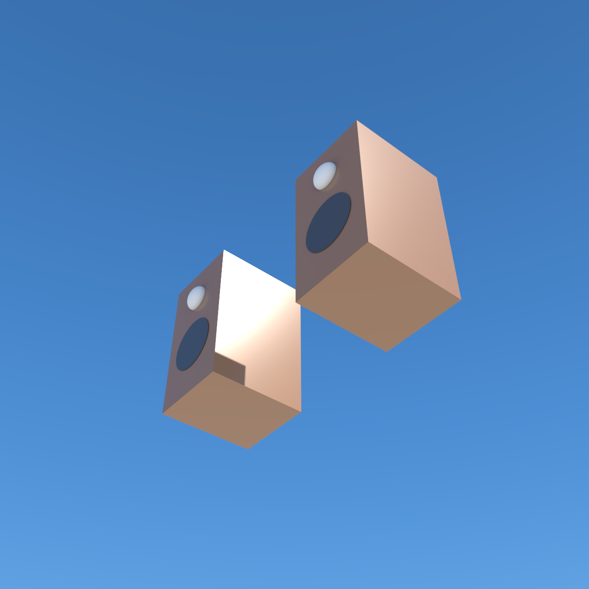

# Bookshelf Speaker Pair

- **Category:** Product visualization
- **Purpose:** Render a pair of two-way bookshelf speaker cabinets (woofer + tweeter + trim rings) side by side with studio lighting, as a reusable product-shot scene.
- **Starter prompt:** Visualise a pair of bookshelf speakers

## Files

- `scene.obj` — combined geometry (one mesh, 8 `usemtl` groups: cabinet/cone/trim/dome × left, right).
- `scene.mtl` — material color/roughness hints matching the OBJ `usemtl` names.
- `scene.json` — command sequence and camera metadata for agents.
- `octane-preview.png` — native Octane X render (beauty=5000, 96 spp).

## MCP tools to use

- `octane_load_recipe` (`bookshelf-speakers`)
- `octane_queue_recipe` (`bookshelf-speakers`) — flushes the queue, writes the 18 commands, drains via the one-shot bridge.
- `octane_save_preview`

## Steps

1. Queue the recipe: `octane_queue_recipe(slug="bookshelf-speakers")`.
2. In Octane X → **Script → `hermes_bridge_oneshot.generated`** (one click drains the whole queue).
3. Inspect `octane-preview.png` for framing/contrast/material correctness.

## Notes

- **Proven-visible path:** one combined OBJ → one `NT_GEO_MESH` node; materials bound per `usemtl` **group** via `assign_material(group_index=1..8)`. Binding a material to the whole mesh does not faithfully colour a multi-material combined subject on this Octane build.
- **Graph owner fix (2026-07-12):** the bridge's `create_node` must pass `graphOwner = octane.project.getSceneGraph()` or nodes land in a script-local graph (scene looks like "only the render node", RT renders sky). Regenerate the bridge (`uv run octanex-mcp init`) after template edits.
- The pair renders against plain sky (no ground plane) — add a backplate/floor for a true product-studio look.
- The woofer reads dark blue in this render (cone material color choice), not charcoal — tune `mat_cone_*` in `scene.json` if you want black.

## Re-render in Octane

1. Import `scene.obj`: `octane_import_geometry(path="examples/recipes/bookshelf-speakers/scene.obj", name="bookshelf_speakers")`.
2. Apply the 8 materials + group assignments from `scene.json`, then camera/lighting/save_preview.
3. Drain via `octane_lua/hermes_bridge_oneshot.generated.lua`.
