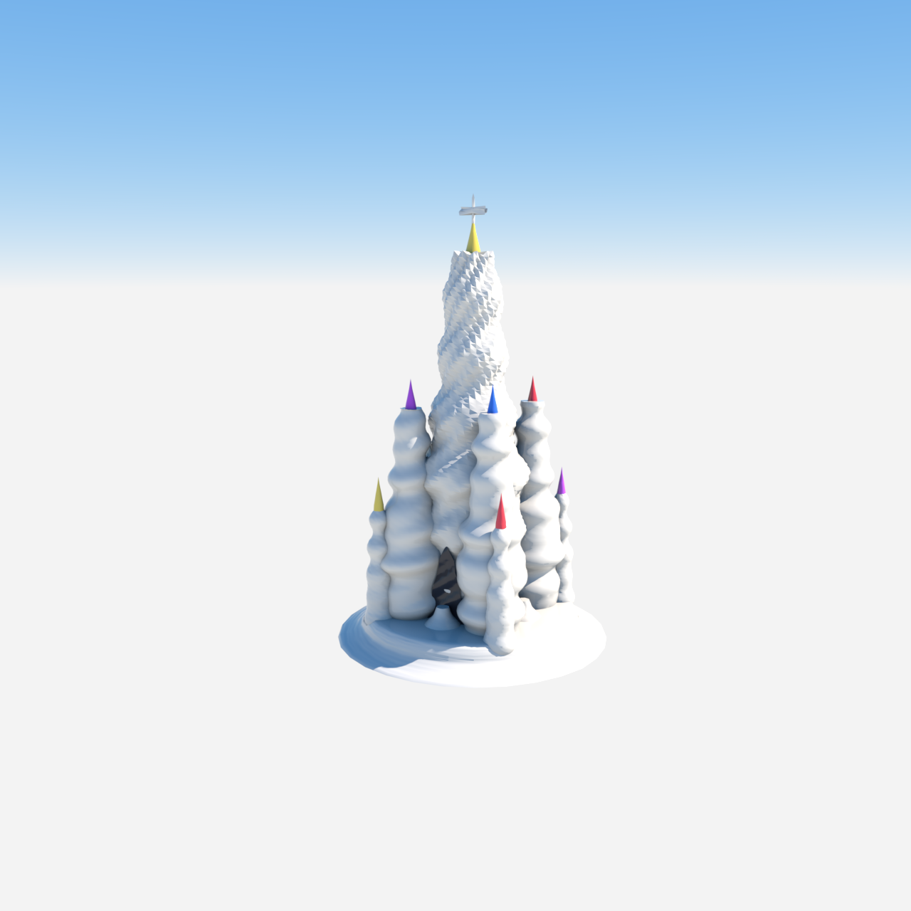

# Sagrada-Familia-style Cathedral — Fluted Spires, Main Door Only



A monolithic, Gaudí-style cathedral rendered in Octane X: a cluster of slender,
golden-ratio-proportioned fluted stone spires rising from a shared base, each
tapering to a sharp needle tip topped with a coloured crown; one arched doorway
at the base centre. The carved-stone relief (cut-stone lobes, fine speckle,
spiral grooves) is **real geometry** — every vertex is displaced along its
surface normal by a shared 3D fractal field, not a normal map.

## Geometry convention

Authored **Y-up** (Octane native). One combined OBJ (`scene.obj`) with one
`o`/`g`/`usemtl` group per material. The stone relief is baked into the mesh, so
the render needs no external texture (the bundled `stone_albedo.png` /
`stone_normal.png` are legacy; `scene.json` ships without a `texture_path`).

| order | material        | kind   | colour             | role                         |
| ---   | ---             | ---    | ---                | ---                          |
| 1     | `mat_stone`     | glossy | `[0.83,0.79,0.71]` | main body, fluted spires    |
| 2     | `mat_glass_gold`| glossy | `[0.95,0.72,0.10]` | central finial + cross base |
| 3     | `mat_glass_violet`| glossy| `[0.55,0.10,0.80]`| side spire crown            |
| 4     | `mat_glass_blue`| glossy | `[0.06,0.20,0.85]` | side spire crown            |
| 5     | `mat_glass_green`| glossy| `[0.05,0.65,0.22]` | side spire crown            |
| 6     | `mat_glass_red` | glossy | `[0.85,0.06,0.08]` | side spire crown            |
| 7     | `mat_cavity`    | glossy | `[0.03,0.03,0.04]` | recessed main door          |

## Run

```bash
hermes mcp call octanex octane_queue_recipe --slug cathedral
```

Then drain Octane X via **Script → `hermes_bridge_oneshot.generated`**; one
click drains the full queue. (Or `python scripts/gen_cathedral.py` to
regenerate `scene.obj`/`scene.json` and queue a live render.)

## How it is built (`scripts/gen_cathedral.py`)

- **Proportions**: every tower base radius (`φ²` central → `/φ` per ring) and
  total height (`φ⁶` central → `/φ` ladder) derive from φ, so the spire cluster
  reads as one harmonious family.
- **Spires**: `lobed_loft` helicoidal towers (twist slashed to ~1.3 rad so they
  don't coil into a "pancake stack"), `lobed_cone_tip` needle crowns with a
  φ-tapered concave neck.
- **Relief** (`stone_displacement`): ~6 cm helical + domain-warped 3D field,
  height-ramped 1.0× (base) → 4× (tip), plus a **real ~11 cm vertical 9-flute**
  term (decoupled from the fine grit so the flutes actually read) tapered off on
  thin tips.
- **Door**: a single `arch_niche` recessed cavity at the base centre, seated on
  the actual central-tower radius (not floating).

## Pitfalls (learned on this build, 2026-07-16)

- **Floating windows are a STALE SCENE-GRAPH symptom, not a generator bug.**
  When we slimmed the trunk, the per-tower window niches (placed at the old fat
  radius) started hanging in mid-air. Removing them from the OBJ is necessary
  but **not sufficient** — Octane X *reopens its last project on launch* (here,
  a left-over Mandelbulb scene), so a bridge click adds the new cathedral
  **beside** the old nodes. Always `octane_reset_octane_scene()` (File ▸ New)
  before/after a recipe swap, and flush the queue, so only the new geometry
  builds. Verify by checking the OBJ vertex count drops as expected (here
  47,522 → 36,602 when windows were removed) and by native-vision inspecting the
  live frame.
- **Displacement that is too small is invisible.** A flute term of ~4 mm on a
  2 m-radius spire resolves to nothing; pushing it to an explicit ~11 cm term is
  what made the carved-stone flutes read. When relief "isn't showing," scale up
  the displacement, don't just add more frequency.
- **Bulbous / snowman look** came from a `1.9×` base flare + fat trunk fusion
  (`merge_r 0.70`); slimming the foot (`1.30×`) and fusion (`0.32`) is what made
  distinct slender columns.
- **Ice-cream / snow-cone look** came from round cross-sections + heavy Laplacian
  smoothing; re-inject angular structure (lobes `0.10`, smoothing `1`) and a real
  radial corrugation to read as carved stone.
- **Pancake stack** came from a 3.6 rad twist coil on the seam + fat diameter;
  slash twist to ~1.3 and diameter ×0.70.
- **Bridge normal-pin**: `create_material` `normal_path` is now wired in both
  bridge templates (`hermes_bridge_oneshot_v2.lua` / `_persistent_v1.lua`) and
  regenerated via `octanex-mcp init`; parity 8/8 OK.
