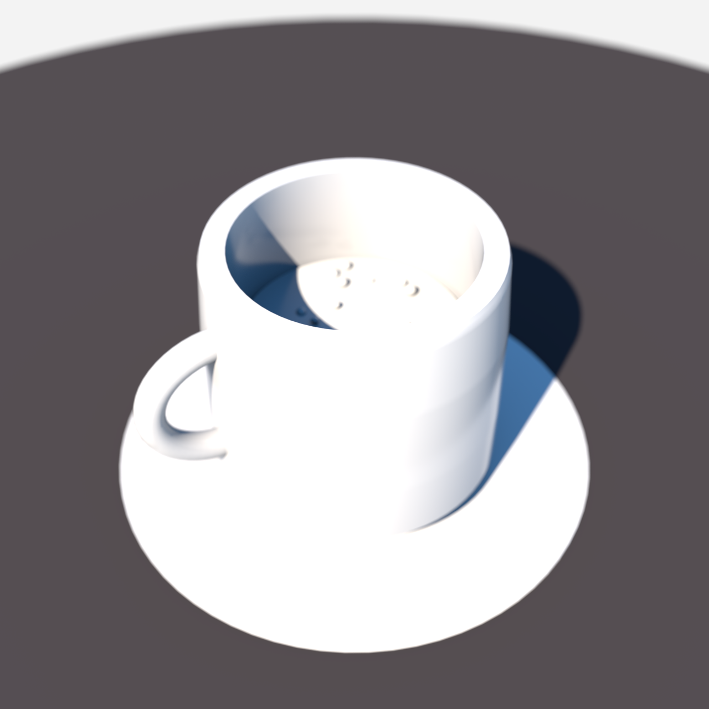

# Designer Coffee Cup with Frothy Dark Brew



An elegant designer coffee cup in warm off-white glazed ceramic: a hollow surface-of-revolution body with a swept-tube handle, standing on a wide matching saucer on a dark table. Inside, a dark espresso brew is capped by a pale frothy crema studded with small foam bubbles. Rendered with soft-studio lighting.

## Geometry convention

Authored **Y-up** (Octane native). The cup body is a true hollow lathe (outer wall + reversed-winding inner wall + rim annulus) so the interior and brew are visible from the slightly-above camera angle.

## Material groups

| order | material | kind | color |
| --- | --- | --- | --- |
| 1 | `mat_table` | diffuse | `[0.06, 0.05, 0.05]` |
| 2 | `mat_saucer` | glossy | `[0.88, 0.85, 0.8]` |
| 3 | `mat_cup` | glossy | `[0.93, 0.9, 0.83]` |
| 4 | `mat_brew` | glossy | `[0.15, 0.07, 0.04]` |
| 5 | `mat_froth` | glossy | `[0.8, 0.66, 0.47]` |
| 6 | `mat_bubble` | glossy | `[0.96, 0.93, 0.86]` |

## Run

```bash
hermes mcp call octanex octane_queue_recipe --slug coffee-cup
```

Then drain Octane X via **Script -> `hermes_bridge_oneshot.generated`**; one click drains the full queue.
