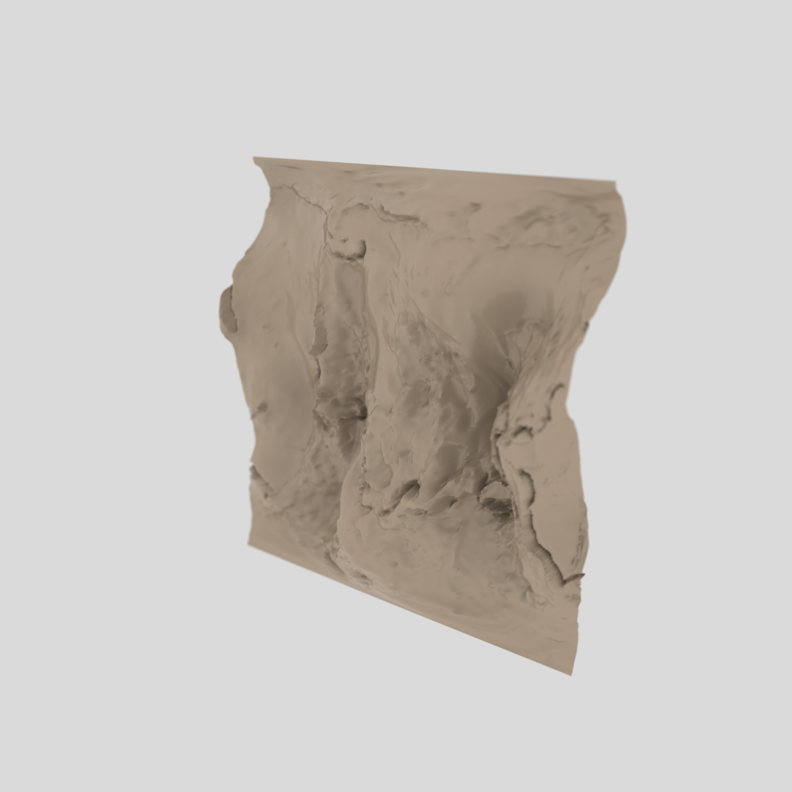

# EGM2008 Geoid Heightfield — 3DXM / ECDO Geo Grammar

A 3D relief of Earth's **geoid undulation** derived from **EGM2008** (the Earth
Gravitational Model 2008), rendered as a single-material heightfield in OctaneX.
First recipe in the geo/earth-data grammar (`docs/recipe-gap-fill.md`).

EGM2008 is a **spherical harmonic Earth gravity model** (degree/order 2159) published
by NGA. The file used here (`us_nga_egm2008_1.tif`) stores the **geoid undulation**
(N) — the height of the quasi-geoid above the WGS84 ellipsoid — a direct gravity-field
product of the model. Units: metres.

- **Source:** `~/ECDO/GIS/us_nga_egm2008_1.tif` — the real EGM2008 geoid-undulation grid
  (float32, global, -107…+85.8 m). *Not* the colour-shaded `EGM2008.tif` (that one is an
  RGB render, useless for displacement).
- **Mesh:** `scripts/gen_geo_displacement.py` → 256×256 grid, 65,536 verts / 130,050 faces; z normalized from the geoid range × vscale 0.6.
- **Material:** earthy `[0.55, 0.42, 0.30]`, glossy, single colour (vertex colours / texture-colour are ignored by the importer — see `docs/recipe-book.md` L60, so no height-colormap yet).
- **Camera:** oblique, rot_x 25° / rot_z 30° (lower angle than TPMS so relief reads).
- **Render:** 1280×1280, ~5000 SPP, dark-studio lighting.
- **Status:** ✅ rendered 2026-07-13 (VLM-confirmed terrain relief).



## Regenerate

```bash
# 1. raster -> heightfield OBJ (homebrew python: gdal + numpy)
env -u PYTHONPATH /opt/homebrew/bin/python3 scripts/gen_geo_displacement.py \
  ~/ECDO/GIS/us_nga_egm2008_1.tif \
  ~/Library/Containers/com.otoy.rndrviewer/Data/OctaneMCP/assets/egm2008.obj \
  256 0.6 egm2008

# 2. queue + render via OctaneX MCP one-shot bridge
env -u PYTHONPATH /opt/homebrew/bin/python3 scripts/queue_geo_surface.py \
  ~/Library/Containers/com.otoy.rndrviewer/Data/OctaneMCP/assets/egm2008.obj egm2008
osascript scripts/octane_run_oneshot.applescript
```

## Notes / gating

- **No height-colormap yet:** the bridge cannot set vertex colours or texture-node colours (`recipe-book.md` L60). A monochrome relief is the current ceiling until a texture-colour path is built.
- **Other real ECDO heightfields ready to use:** `elevation.tif` (global elevation/bathymetry, int16), `gebco_bathy` (bathymetry, uint16), `EMAG2_SeaLevel_tiff` (magnetic anomalies, float32), `sq5.tif` (scalar field, float64).
- **Next geo recipes** (see `docs/recipe-gap-fill.md`): `geo-kml-extrude` (ECDO.kmz), `geo-climate-globe` (CERES NetCDF — needs `netCDF4`/`xarray` installed), `geo-volcano-scatter` (eruption CSVs).
