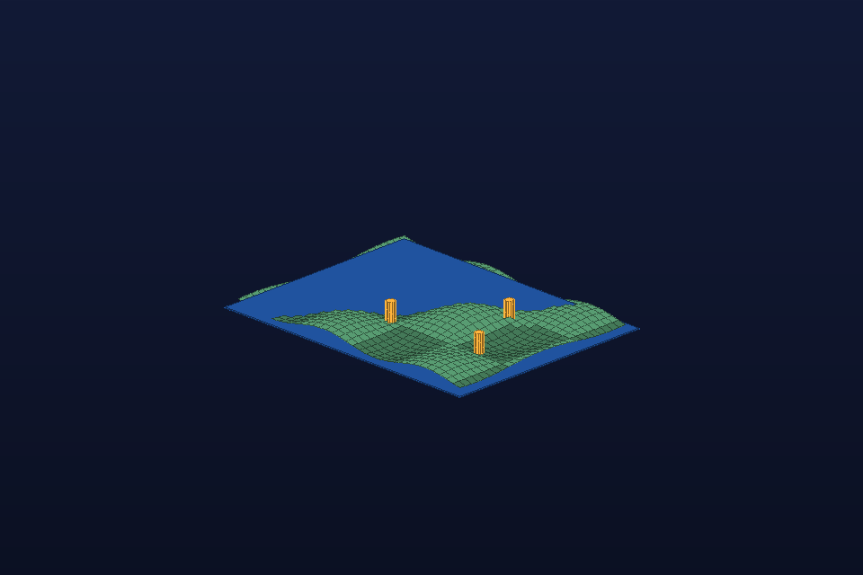

# Terrain and Site Markers

- **Category:** Geospatial/science
- **Purpose:** Represent a small terrain tile with highlighted points of interest, suitable for GIS-to-Octane experiments.
- **Starter prompt:** Show terrain relief with several site markers for a geospatial explanation.

## Files

- `scene.obj` — reusable geometry scene.
- `scene.mtl` — material color/roughness hints matching the OBJ `usemtl` names.
- `scene.json` — command sequence and camera metadata for agents.
- `preview.png` — lightweight generated preview for quick review in GitHub/docs.

## MCP tools to use

- `octane_import_geometry`
- `octane_set_camera`
- `octane_save_preview`

## Steps

1. Generate terrain mesh from height data or a formula.
2. Add marker cylinders for sites/events.
3. Use a wide camera and verify scale/readability.

## Variations to explore

- Replace synthetic terrain with DEM or GeoJSON-derived geometry.
- Encode uncertainty with marker height or color.

## Quality checklist

- Preview is non-blank and recognizable at thumbnail size.
- Camera frames the entire subject with clear margins.
- Materials in `scene.obj` match `scene.mtl` and `scene.json`.
- If Octane drops OBJ line primitives, convert paths/arrows to thin cylinders or tubes for final native renders.
- Record any useful native-render success or failure in `docs/recipe-book.md`.

## Re-render in Octane

1. Import `scene.obj` with `octane_import_geometry(path="examples/recipes/geospatial-terrain/scene.obj", name="geospatial-terrain")`.
2. Apply camera from `scene.json`.
3. Drain the queue once with `octane_lua/hermes_bridge_oneshot.generated.lua`, then poll `queue/` to zero.
4. Save an Octane preview and replace/add it alongside `preview.png` if it teaches a useful lesson.
