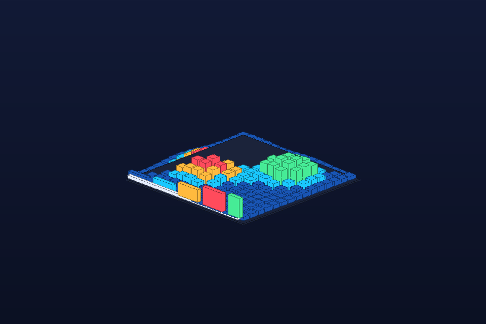

# Image Heightfield and Mask Inspection

- **Category:** Image processing/vision
- **Purpose:** Turn a small image, heatmap, or segmentation mask into raised tile geometry for visual QA in Octane.
- **Starter prompt:** Visualize model attention or segmentation output as a 3D heatfield with raised mask regions.

## Files

- `scene.obj` — reusable geometry scene.
- `scene.mtl` — material color/roughness hints matching the OBJ `usemtl` names.
- `scene.json` — command sequence, camera metadata, pitfalls, and validation checklist.
- `preview.png` — lightweight generated preview for quick review in GitHub/docs.

## MCP tools to use

- `octane_load_recipe`
- `octane_queue_recipe`
- `octane_import_geometry`
- `octane_review_preview`

## Steps

1. Downsample image or scalar grid before geometry generation.
2. Map scalar intensity to tile height and material color.
3. Raise segmentation/mask regions with a distinct material.
4. Store value range and sampling assumptions in scene metadata before native rendering.

## Variations to explore

- Use OCR bounding boxes as raised document-layout tiles.
- Use image differences as red/blue residual maps.
- Use spectrogram or saliency matrices as relief surfaces.

## Known pitfalls

- Dense images can generate too many OBJ faces; downsample aggressively before queueing.
- Color maps can hide magnitude errors; keep a legend and value range in metadata.
- Native Octane preview should be checked for clipping because tall hot/mask regions can dominate framing.

## Quality checklist

- Preview is non-blank and the central idea is recognizable at thumbnail size.
- Scene imports the local scene.obj path listed in commands[].
- Camera frames the entire subject with margin.
- Materials named in OBJ usemtl statements are documented in scene.mtl and scene.json.
- Native Octane output must be saved as octane-preview.png before claiming native render success.

## Re-render in Octane

1. Load or queue this recipe with `octane_load_recipe("image-heightfield-mask")` or `octane_queue_recipe("image-heightfield-mask")`.
2. Run the one-shot bridge or an on-demand managed persistent bridge action in Octane X.
3. Save an Octane preview and inspect it with `octane_review_preview` before claiming native success.
