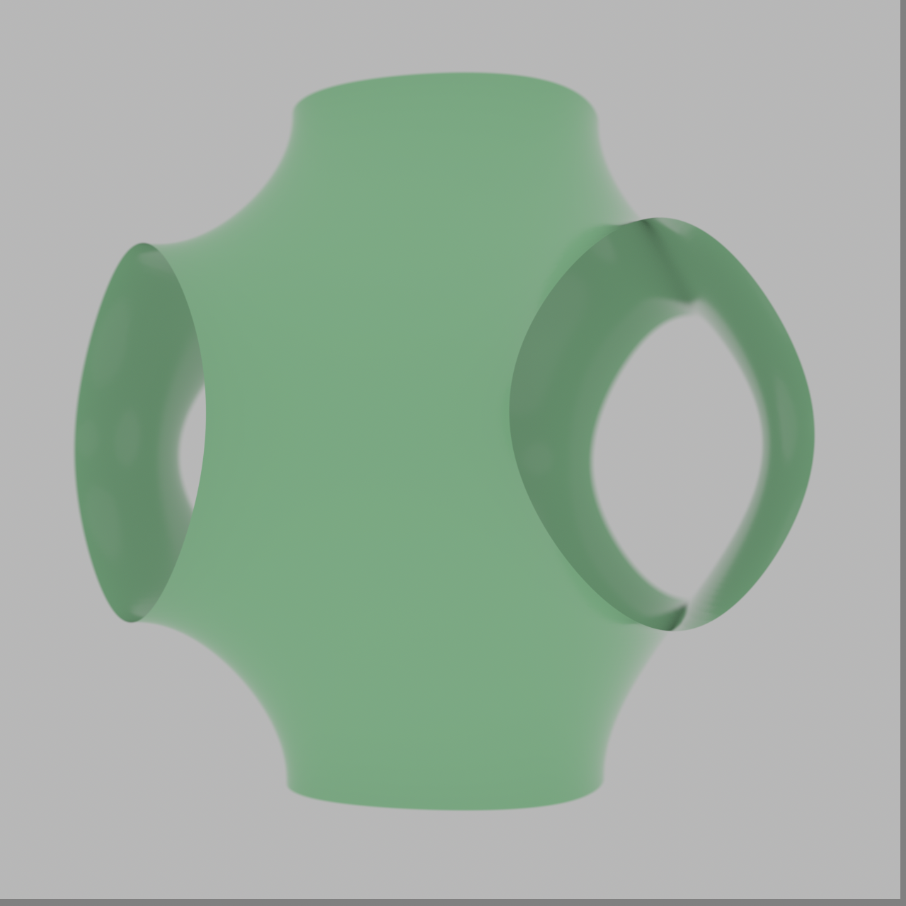

# lidinoid — 3DXM Minimal-Surface Gallery

- **Equation:** n/a (parametric)
- **Form:** single manifold (mesh verified, 1 connected component)
- **Material:** per-surface palette (see docs/recipe-book.md)
- **Camera:** oblique (60° X, 30° Z)
- **Render:** 1280×1280, ~5000 SPP
- **Status:** ✅ rendered (autonomous run 2026-07-13); VLM check: YES. Your render appears to capture the essential characteristics and topology of a lidinoid surface, including its single-connected manifold structure and symmetrical features. However, it may not pe
