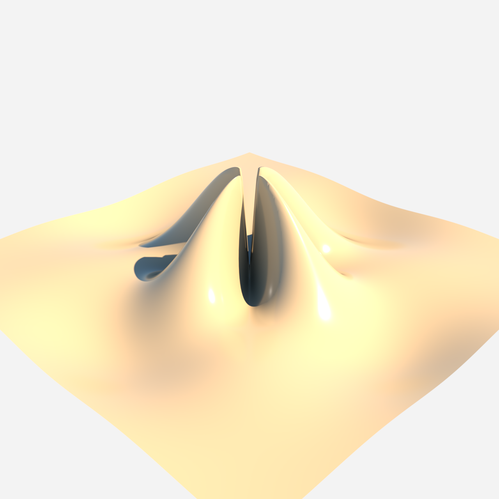

# Photoreal mathematical 3D surface (sinc + azimuthal ridge)



- **Category:** Mathematics
- **Purpose:** Render a glossy bronze height field `z = sin(r)/max(r,0.3) · (0.45 + 0.55·cos(4·θ)) · 2.8` to explain radial damping, singularity protection, and azimuthal modulation — photo-real, not a schematic.
- **Starter prompt:** `Visualise a photorealistic mathematical 3D surface.`

## Files

- `scene.obj` — reusable geometry (Python-generated, ~40k verts / 79k tris, single `usemtl` group).
- `scene.mtl` — material color/roughness hints (Octane **ignores** `Kd`; see gotchas).
- `scene.json` — command sequence + camera/material metadata for agents.
- `octane-preview.png` — real Octane X render (ultra quality tier, 1280×1280).

## Generator

The OBJ is produced by `scripts/gen_math_surface.py` (parametrised; single `usemtl`
group → one material pin, no `group_index` needed):

```
z = sin(r)/max(r,0.3) * (0.45 + 0.55*cos(4*atan2(y,x))) * 2.8
r = hypot(x,y),  x,y ∈ [-6, 6],  200×200 grid
```

Re-run: `uv run python scripts/gen_math_surface.py` (writes to `OctaneMCP_staging/`).

## MCP tools to use

- `octane_import_geometry` — load the generated `scene.obj`.
- `octane_create_material` — explicit glossy bronze material (MTL `Kd` is ignored).
- `octane_assign_material` — pin the material to the mesh.
- `octane_set_camera` / `octane_set_lighting` — framing + `soft_studio` preset.
- `octane_save_preview` — with a **convergence `quality` tier** (see below).

## Steps (queue ALL in ONE live Octane session)

1. Generate the OBJ (`scripts/gen_math_surface.py`) and copy it into the container
   workspace `OctaneMCP/assets/` (sandboxed Octane only reads container FS).
2. Queue the full pipeline in order:
   - `import_geometry(path="…/scene.obj", name="math_surface")`
   - `create_material(name="math_surface_mat", kind="glossy", color=[0.85,0.55,0.25], roughness=0.3)`
   - `assign_material(object_name="math_surface", material_name="math_surface_mat")`
   - `set_camera(position=[11,9,11], target=[0,0.5,0], fov=40)`
   - `set_lighting(preset="soft_studio")`
   - `save_preview(width=1280, height=1280, quality="high")`  ← convergence tier
3. Drain with the one-shot bridge. **Repeat the click until `queue/` is empty**
   (the persistent auto-poll timer is broken — ~1 command per click).
4. Inspect whether peaks are clipped; reduce expression amplitude if needed.

## Render convergence quality tiers

`octane_save_preview` accepts a `quality` preset that sets a wall-clock convergence
ceiling (defined in `src/octanex_mcp/models.py` as `QUALITY_TIERS`):

| tier     | max_render_time | timeout_seconds | min_samples | samples  | use                          |
|----------|-----------------|-----------------|-------------|----------|------------------------------|
| standard | 30              | 30              | 24          | 512      | quick check                  |
| high     | 60              | 60              | 48          | 1024     | good quality (default ask)   |
| ultra    | 120             | 120             | 96          | 2048     | presentation                 |
| final    | 0 (unlimited)   | 600             | 1024        | 1000000  | master, bounded by wall cap  |

Raw `samples` / `min_samples` / `timeout_seconds` / `max_render_time` override the
tier when passed explicitly. On the wall-clock cap the current frame is saved
**best-effort** (the handler no longer aborts on timeout).

> **CONFIRMED:** the GPU `maxRenderTime` film pin is **ignored** on this Octane build
> (probe found no honored pin). The effective convergence cap is the Lua
> `wait_for_render_ready` wall-clock `timeout_seconds`, NOT a GPU pin. The quality
> tiers resolve their budget into `timeout_seconds`, so the feature works regardless.

## Critical gotchas (cost real rework to learn)

- **Do NOT restart Octane X between `import_geometry` and the `save_preview`.**
  A restart purges the in-memory scene → later commands run against an empty scene →
  uniform gray frame `(243,243,243)`, ~16 KB. Restart Octane X only to reload a
  *patched bridge*, and do it *before* queueing any scene command.
- **One-shot bridge drains ~1 command per click** (persistent timer is broken).
  Poll `queue/` and repeat until empty.
- **MTL `Kd` is ignored on `import_geometry`** — create + assign an explicit material.
- **Container FS is slow & render is long** — a 79k-tri surface @ 512 samples took
  ~90 s before the PNG appeared. Don't conclude failure early.
- `octane_record_recipe` MCP tool may be absent in-session → record inline in
  `NOTES-*.md` / `docs/recipe-book.md`.

## Verify (don't trust a pretty thumbnail)

- PIL full-frame scan: real surface → brightness min ~60, max ~765, warm pixels
  `(255,235,179)` present; blank frame → min==mean==max ~729 and tiny file.
- `vision_analyze`: confirm a curved surface with shading/depth, centered, framed.

## Variations to explore

- Overlay sample points or gradient vectors.
- Use surfaces for loss landscapes or potential fields.
- Swap the function in `scripts/gen_math_surface.py` for a different analytic surface.

## Re-render in Octane

1. Import `scene.obj` with `octane_import_geometry(path="examples/recipes/math-surface/scene.obj", name="math_surface")`.
2. Apply the camera + material from `scene.json`.
3. Drain the queue with the one-shot bridge (`octane_lua/hermes_bridge_oneshot.generated.lua`), repeating until `queue/` is empty.
4. Save with a convergence tier: `octane_save_preview(width=1280, height=1280, quality="ultra")`.
5. Replace `octane-preview.png` if the new render teaches a useful lesson.
6. Record any native-render success or failure in `docs/recipe-book.md`.
