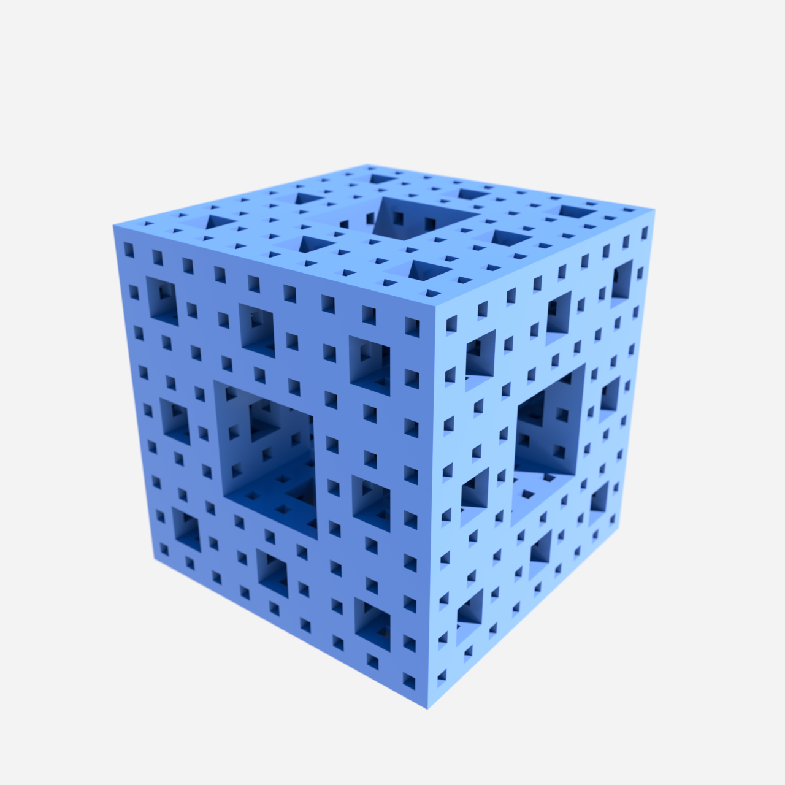

# Menger Sponge — recursive fractal cube (depth 3)



The Menger sponge: the 3D analogue of the Sierpinski carpet. Start from a cube,
subdivide into a 3×3×3 grid (27 subcubes), remove the centre subcube and the
centre of each face (7 of 27), then recurse on the 20 survivors. At depth `d`
there are 20ᵈ subcubes — 8,000 at depth 3 — joined into one combined OBJ of
solid boxes (flat-shaded, no internal faces between adjacent survivors).

Rendered here in cool blue glossy material under a `soft_studio` preset so the
recursive square-void pattern reads clearly.

## Geometry convention

Authored **Y-up** (Octane native). One combined OBJ (`scene.obj`) with a single
`o`/`g`/`usemtl` group (`mat_sponge`) and a shared vertex pool. Each surviving
subcube is emitted as 6 flat-shaded faces (24 verts/cube, per-face normals), so
the sponge needs **no texture** and shades crisply.

| order | material      | kind   | colour             | role          |
| ---   | ---           | ---    | ---                | ---           |
| 1     | `mat_sponge`  | glossy | `[0.16,0.34,0.86]` | whole sponge  |

Depth-3 stats: 8,000 cubes · 192,000 verts · 96,000 faces.

## Run

```bash
hermes mcp call octanex octane_queue_recipe --slug menger-sponge
```

Then drain Octane X via **Script → `hermes_bridge_oneshot.generated`**; one click
drains the full queue. (Or `python scripts/queue_menger.py` to regenerate
`scene.obj` from `scripts/gen_menger.py` and queue a live render against the
container copy.)

## How it is built (`scripts/gen_menger.py`)

- **Occupancy test** `is_occupied(x,y,z,depth)`: a subcube is removed if, at
  *some* recursion level, **≥2 of its 3 base-3 digits equal 1** (centre cube
  `1,1,1` + the six face-centres like `1,1,0`). That removes 7/27 and leaves
  20 survivors per axis → 20ᵈ cubes (8,000 at depth 3). *(This is the corrected
  rule — see Pitfalls.)*
- **Mesh**: every surviving subcube is a solid box (8 corners, 6 faces), flat-
  shaded with per-face normals so edges stay sharp. Shared vertex pool; face
  indices reference global verts (valid OBJ).
- **Single material**: one `usemtl mat_sponge` block — the importer makes one
  material pin, bound by name.

## Pitfalls (learned on this build, 2026-07-18)

- **Wrong removal rule = solid cube.** The first generator removed a subcube
  only when *all three* base-3 digits equal 1 — that deletes just the single
  central subcube, leaving 26³ = 17,576 near-solid cubes. Vision inspection
  caught it (render looked like a plain cube). The correct Menger rule removes
  when **≥2 of 3 digits == 1**, giving 20³ = 8,000 porous cubes. Always verify
  the cube *count* against 20ᵈ, not just that the OBJ imports.
- **Stale scene graph on Octane launch.** Octane X reopens its *last project* on
  launch, so a bridge click can build new geometry *beside* old nodes. Do a
  warm `octane_reset_octane_scene()` (File ▸ New) before/after a recipe swap and
  flush the queue, then verify by checking the OBJ vertex count and native-vision
  inspecting the live frame.
- **TCC/`-1719` blocks the drain, not the render.** If `run_bridge_script` or
  `reset_octane_scene` returns `-1719`, grant macOS Accessibility to the Hermes
  agent-runtime python (`/Users/craig/.hermes/hermes-agent/venv/bin/python`), not
  `Hermes.app`, then fully relaunch Hermes. The queue can still be populated
  without TCC; only the UI-scripted drain needs it.
