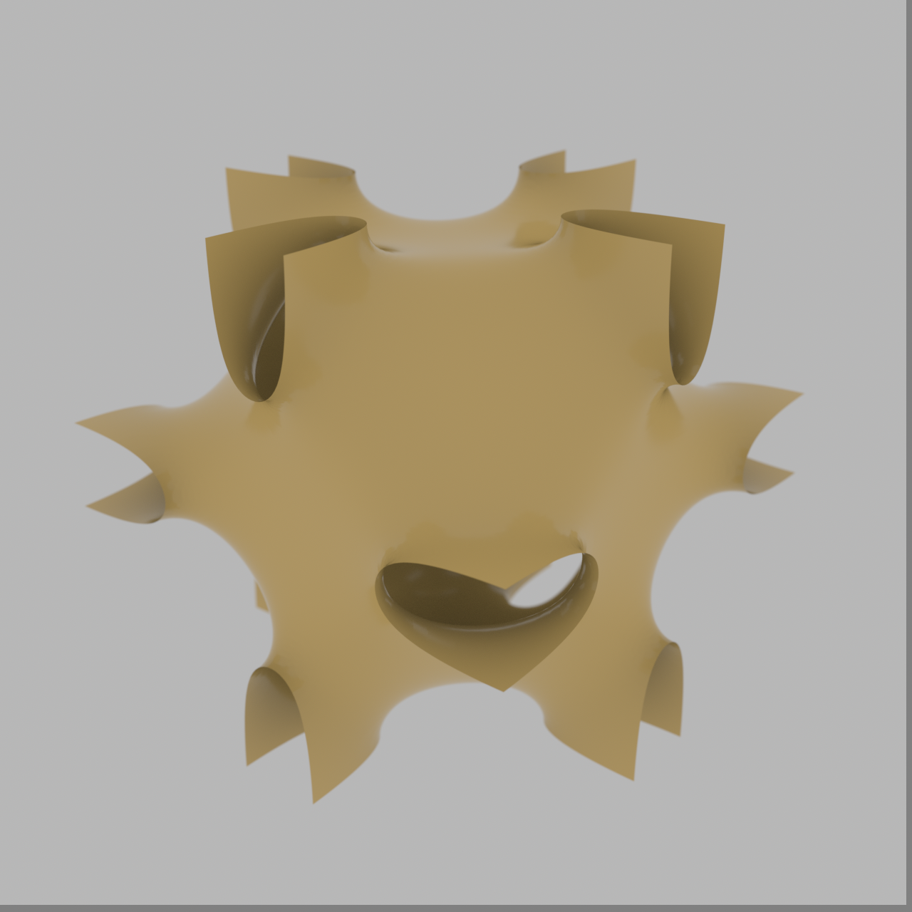

# Neovius — 3DXM Minimal-Surface Gallery (Surface #2)



A single amber Neovius minimal surface, rendered in OctaneX via the MCP bridge.

- **Equation:** `3(cos x + cos y + cos z) + 4 cos x cos y cos z = 0` (verified against Wikipedia / HandWiki / Wolfram)
- **Form:** single manifold (one fundamental domain / unit cell), 1 connected component
- **Mesh:** 86,256 verts / 170,444 faces (`neovius.obj`, plain single-material OBJ)
- **Material:** amber `[0.95, 0.55, 0.15]` (one solid glossy colour)
- **Render:** 1280×1280, ~5000 SPP, dark-studio lighting, auto-framed camera
- **Status:** ✅ approved (2026-07-13)

## Regenerate

```bash
# mesh (single manifold, correct equation)
python3 scripts/gen_implicit_surface.py <out.obj> neovius neovius 132 2.5 1

# queue + render via OctaneX MCP one-shot bridge
python3 scripts/queue_implicit_surface.py <out.obj> neovius
osascript scripts/octane_run_oneshot.applescript
# capture the 1280x1280 render box from the Octane window (display 2, upper-left)
```

## Lessons (see docs/recipe-book.md → "Surface #2 — Neovius")

- Per-surface equation research is a prerequisite — the wrong (double-angle) equation produces a non-Neovius.
- Single manifold only: mesh `[-π,π]³` (periods=1) and keep the largest connected component.
- Material colour is per-surface — never hardcode (a hardcoded blue colour shipped blue Neovius once).
- Use the local qwen2.5vl vision model for visual QA; resize to ~640px first.
- Capture the Octane viewport (1280×1280 box, upper-left of the window on display 2), not the full display.
