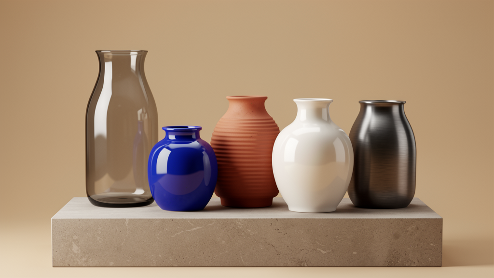

# Photoreal Multi-Vase Studio

A product-studio recipe for a collection of vases with intentionally varied silhouettes, colours, texture treatments, and material intent.



## Starter prompt

Create a high-end catalog render of several vases on a matte stone pedestal. Make each vase materially distinct: translucent smoky glass, glossy cobalt ceramic, matte ribbed terracotta, pearlescent white porcelain, and dark brushed metal. Use warm neutral cyclorama lighting, large softbox reflections, realistic shadows, and no text.

## What is included

- `scene.obj` — generated lathe-style vase geometry, pedestal, cyclorama proxy, shadow pad, and softbox panels.
- `scene.mtl` — material hints for OBJ import.
- `scene.json` — camera, lighting, material intent, command sequence, pitfalls, and quality checklist.
- `photoreal-preview.png` — target/reference visual for quality, not native Octane proof.

## MCP workflow

1. Load the recipe with `octane_load_recipe("photoreal-vase-studio")`.
2. Queue it with `octane_queue_recipe("photoreal-vase-studio")`.
3. Drain the queue through the one-shot or persistent Octane bridge.
4. Save the native preview to `octane-preview.png`.
5. Review the saved preview before claiming native render success.

## Iterative visual refinement protocol

This recipe is intentionally a target-matching task, not a one-shot OBJ export. The first `scene.obj` is only a candidate approximation of the reference. The intended loop is:

1. Render the candidate in Octane X and save `octane-preview.png`.
2. Run local cheap visual analysis with `glm-ocr` through Ollama:

   ```bash
   ollama run glm-ocr "Describe the objects, materials, lighting, perspective, and mismatch risks in this image." photoreal-preview.png
   ollama run glm-ocr "Describe the objects, materials, lighting, perspective, and mismatch risks in this image." octane-preview.png
   ```

3. Compare those notes and patch one bounded dimension at a time: geometry proportions, vase spacing, camera/FOV, softbox placement, or material intent.
4. Re-render and repeat until object count, material readability, lighting, and camera perspective are close enough or the remaining gap requires bridge schema work.

The same protocol is captured in `scene.json` under `visual_iteration_protocol`.

## Final bundle requirement

The final iterated native Octane render and all assets needed to reproduce it should be bundled with this recipe before `native_octane_verified` is set to `true`:

```text
photoreal-vase-studio/
├── octane-preview.png          final native render
├── iterations/final-review.json
├── iterations/iteration-*.json
├── iterations/iteration-*.png
└── assets/                     optional textures/HDRIs/normal maps/reference assets
```

Until those files exist, `photoreal-preview.png` remains a target/reference only.

## Variations

- Swap the material palette for monochrome museum ceramics.
- Increase vase count and use the same lathe profile pattern for collections.
- Replace ribbed geometry with real normal maps once texture/normal-map payloads are supported.
- Promote material intent into native Octane glass/metal/ceramic commands when the bridge schema expands.

## Known pitfalls

- OBJ/MTL cannot fully express glass transmission, IOR, clearcoat, anisotropic brushed metal, or procedural ceramic glaze.
- The ribbed terracotta and brushed metal cues are geometry/material approximations.
- The generated target preview is a visual quality bar, not a native render.
- Always verify native output via bridge result metadata plus an inspected `octane-preview.png`.
