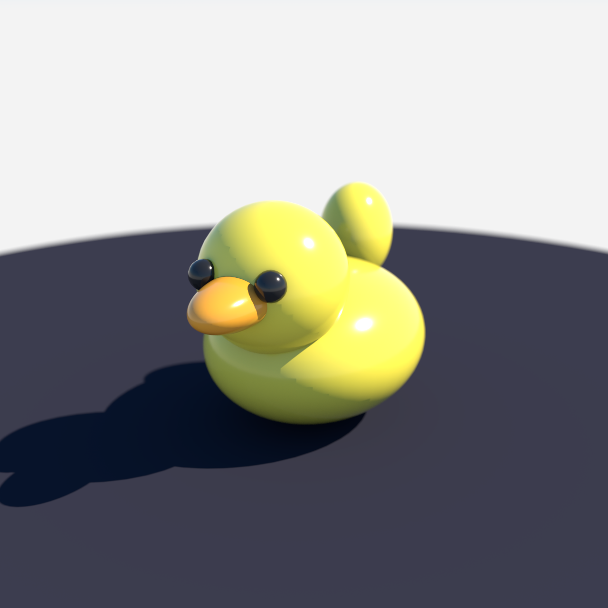

# Rubber Duck



A stylised rubber duck: a fat yellow body, a yellow head merging into the body,
an up-swept tail, an orange beak protruding forward, two black eyes, and a dark
matte floor for grounding, under soft studio lighting.

The scene is a **single combined OBJ** (`scene.obj`) with one `usemtl` group per
material and one `o`/`g` per group. Colour is applied through explicit
`create_material` + `assign_material` commands that bind each material to the
mesh's material-input pin **by name** (e.g. `mat_body` → pin `mat_body`). The
OBJ also bakes per-vertex colours as a hint, but on this Octane X build the
importer ignores them, so name-based binding is the reliable colour path.

## Material groups

| material | kind | color |
| --- | --- | --- |
| `mat_body` | glossy | `[0.97, 0.82, 0.07]` (yellow) |
| `mat_beak` | glossy | `[0.96, 0.42, 0.03]` (orange) |
| `mat_eye` | glossy | `[0.02, 0.02, 0.02]` (black) |
| `mat_floor` | diffuse | `[0.03, 0.03, 0.045]` (dark) |

## Run

```bash
hermes mcp call octanex octane_queue_recipe --slug rubber-duck
```

Then drain Octane X via **Script -> `hermes_bridge_oneshot.generated`**; one click
drains the full queue.

## Verification

`octane-preview.png` is the native Octane X render from 2026-07-15 (after the
material-binding fix). Pixel QA reported a 1280x1280 PNG, 272,683 bytes,
foreground 54.9%, contrast 91.3, `likely_blank=false`. Central-region sampling
found ~5.8% clearly-yellow body pixels plus 27.6% warm midtones. The bridge log
shows `material mat_body -> pin mat_body`, `mat_beak -> pin mat_beak`,
`mat_eye -> pin mat_eye`, `mat_floor -> pin mat_floor`.

## Notes

- Regenerate geometry with `PYTHONPATH= uv run python scripts/gen_rubber_duck.py`.
- The duck faces +Z (toward the camera) so the beak and eyes read in the
  front-three-quarter hero shot.
- The assign_material bridge handler matches by `material_name`; do not rely on
  `group_index` — the mesh exposes one pin per unique material, not per OBJ group.
