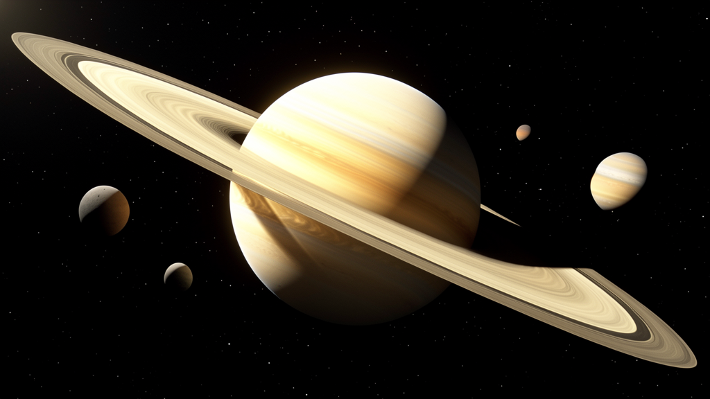

# Saturn and Moons in Space

- **Category:** Photoreal/PBR space rendering
- **Purpose:** Demonstrate a high-quality Saturn target with oblate banded planet geometry, layered rings, Cassini division cue, moons, and cinematic space lighting.
- **Starter prompt:** Render a photoreal Saturn in deep space with tilted rings, visible Cassini division, several moons, black star field, and hard sunlight.

## Files

- `scene.obj` — reusable procedural Saturn system geometry: oblate planet, ring bands, dark division cue, and moons.
- `scene.mtl` — material intent for Saturn gas bands, translucent dusty rings, Titan-like moon, icy moons, and rocky moons.
- `scene.json` — camera, lighting, PBR material notes, quality checklist, and MCP command sequence.
- `photoreal-preview.png` — photoreal target/reference image for visual review.

## Important note

`photoreal-preview.png` is a generated target/reference render for teaching and visual direction. It is **not yet a verified native Octane output** from the bridge. Use it as a quality bar, then re-render `scene.obj`/`scene.mtl` in Octane X and add `octane-preview.png` once the native render has been verified.

The checked-in geometry uses procedural band and ring materials so it stays lightweight and deterministic. For final hero renders, replace the banding/ring masks with real Saturn texture maps, procedural noise nodes, and volumetric scattering when the bridge exposes richer texture/material wiring.

## MCP tools to use

- `octane_import_geometry`
- `octane_set_camera`
- `octane_set_lighting`
- `octane_start_render`
- `octane_save_preview`

## Steps

1. Import `scene.obj` with `octane_import_geometry(path="examples/recipes/saturn-moons-space/scene.obj", name="saturn-moons-space")`.
2. Apply the camera from `scene.json`.
3. Use a hard directional sun/space lighting setup. If `space_sun` is unavailable, start with `soft_studio`, then manually tune toward black background, hard sunlight, and readable ring shadows.
4. Drain the queue once with `octane_lua/hermes_bridge_oneshot.generated.lua`, then poll `queue/` to zero.
5. Save a native Octane preview and compare it with `photoreal-preview.png`.

## What agents should learn

Photoreal Saturn renders need layered structural intent:

- planet: slightly oblate spheroid, not a perfect sphere;
- gas bands: subtle warm horizontal bands with muted color contrast;
- rings: multiple thin translucent annuli plus a dark Cassini division cue;
- moons: small scaled reference bodies that support depth and scene scale;
- lighting: hard sunlight, black space, rim light, and ring/planet silhouette readability.

## Quality checklist

- Target/reference image shows recognizable Saturn, tilted rings, Cassini division, moons, and black space background.
- Native Octane output must be saved as `octane-preview.png` before claiming native photoreal success.
- Saturn should read as slightly oblate with subtle horizontal color bands, not a flat-colored sphere.
- Rings should be thin, layered, and partially translucent with a visible dark division cue.
- Moons should remain small scale references and not compete with the planet/rings silhouette.
- If ring transparency or shadows are poor, tune ring materials before using the render as a hero image.

## Variations to explore

- Add ring-plane shadow on Saturn after native renderer/material support improves.
- Add moon labels or orbital traces as optional explanatory overlays.
- Create a camera flyby animation using the frame-sequence pattern.
- Replace procedural bands with real Saturn equirectangular texture maps.
- Add comparative scale shots: Earth, Titan, Enceladus, or ring-thickness exaggeration for education.
