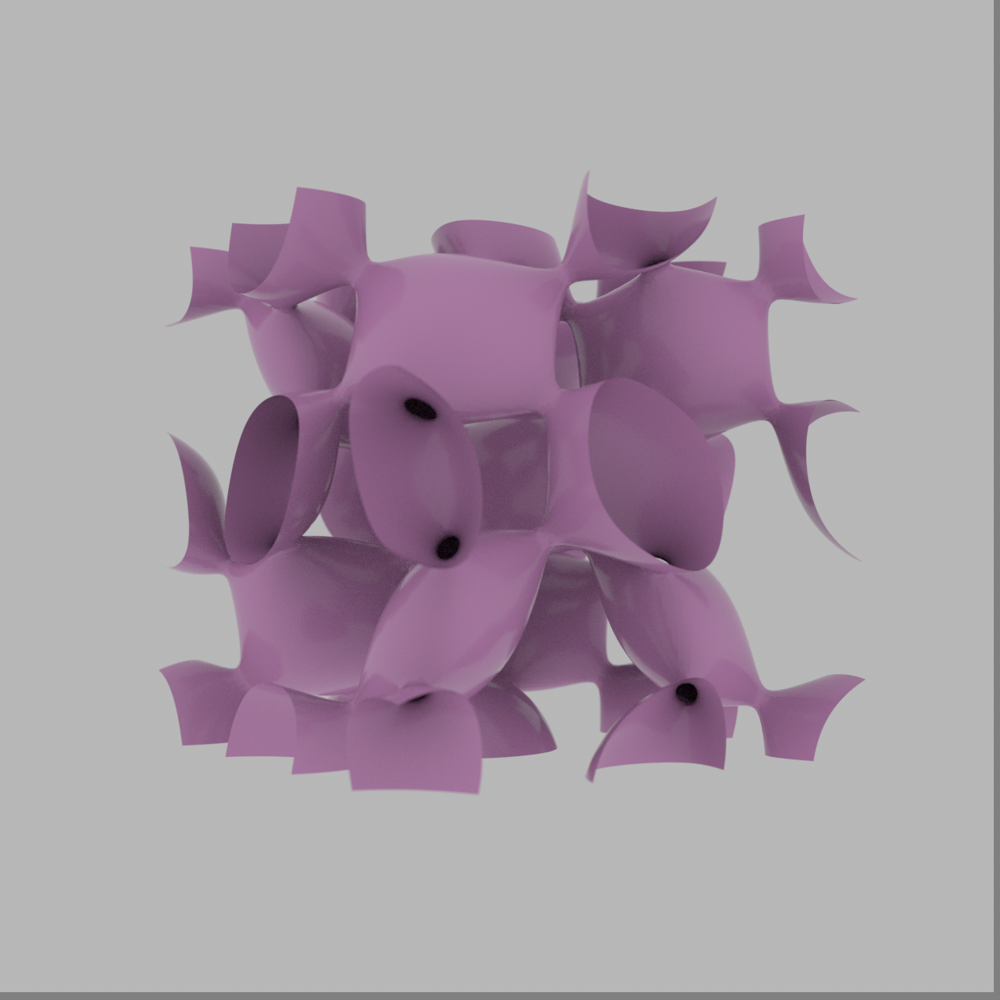

# schwarz_p — 3DXM Minimal-Surface Gallery

- **Equation:** cos x + cos y + cos z = 0
- **Form:** single manifold (mesh verified, 1 connected component)
- **Material:** per-surface palette (see docs/recipe-book.md)
- **Camera:** oblique (60° X, 30° Z)
- **Render:** 1280×1280, ~5000 SPP
- **Status:** ✅ rendered (autonomous run 2026-07-13); VLM check: YES. The image appears to have the correct topology and symmetry for a Schwarz P surface, which typically exhibits a complex, interconnected structure with multiple arms extending from a central point
