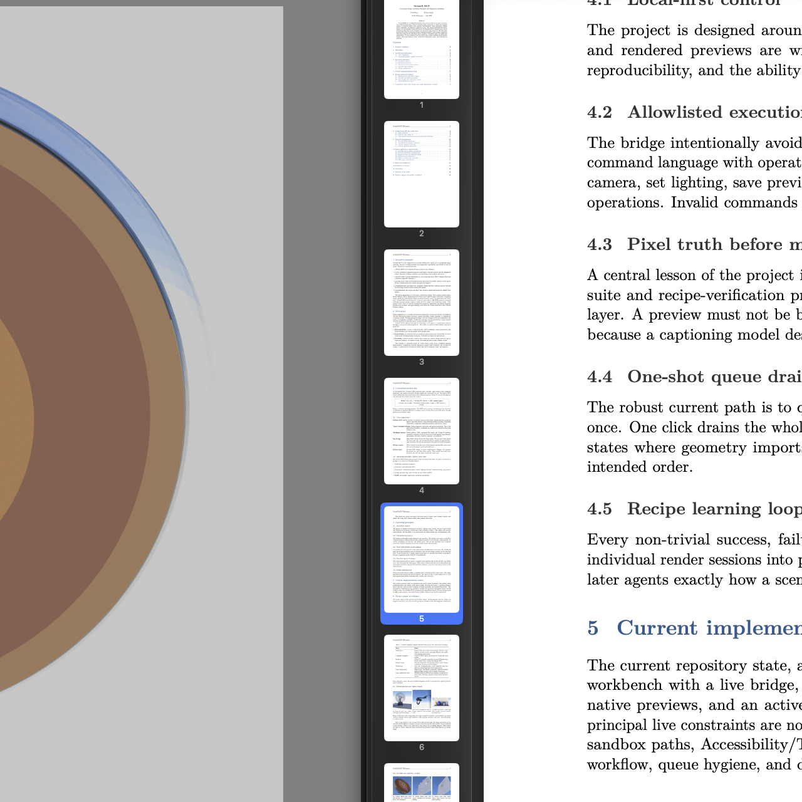

# Solid Earth — concentric shell cutaway (mesh equivalent)

A **mesh-only** hemispherical cutaway of the interior and fluid envelopes of the
Earth, derived from the Volumetric / point-cloud `earth-hemisphere` recipe but
with **no volumetric particles**. Every layer is real polygonal geometry:
hemispherical shell surfaces plus flat concentric cut-face annuli, with WGS84
oblateness and a 1:1 GeoTIFF elevation/bathymetry displacement applied to the
crust surface.



## What it shows

- **WGS84 oblate spheroid** — equatorial radius 6378.137 km, polar radius
  6356.752 km (polar axis compressed by `FLAT = b/a ≈ 0.996647`).
- **PREM-like concentric shells** (to scale, scene unit = 1000 km):
  - inner core: 0–1221.5 km (opaque emissive — reads as a hot solid, not a void)
  - outer core: 1221.5–3480 km (translucent, fluid)
  - lower mantle: 3480–5701 km
  - upper mantle: 5701–6346 km
  - crust: 6346–6371 km (Moho at ~6346 km)
- **Real crust topography** — `~/ECDO/GIS/elevation.tif` is sampled per vertex
  and applied as **1:1 metre→kilometre radial displacement** on the crust
  surface, so continents/bathymetry are actual relief, not a colour map. The
  crust is also tinted by a continent/ocean/ice mask.
- **Atmosphere shells** — troposphere / stratosphere / mesosphere / thermosphere
  (to 600 km) as faint translucent specular sheaths.
- **LLSVP / plume context** — two CMB-rooted thermochemical provinces and plume
  conduits modelled as mesh ribbons on the cut face (mesh-only, not particles).

## Scale

| Quantity | Value |
| --- | --- |
| Scene unit | 1000 km |
| Equatorial radius | 6378.137 km (6.378 scene units) |
| Polar radius | 6356.752 km |
| Surface mean radius | 6371 km |
| Crust base / Moho | 6346 km |
| Atmosphere top | 6471 km (600 km envelope) |
| Elevation displacement | 1:1 (GeoTIFF metre → km) |

## Why mesh, not particles

The `earth-hemisphere` point-cloud recipe communicates the deep interior as
translucent instanced spheres (jello). This recipe is the **mesh-equivalent**:
the same shells, radii, oblateness, and crust differentiation, but expressed as
closed surfaces + cut-face annuli. It is the right form when you want clean
concentric layers and a crisp cut face rather than a volumetric cloud, and it
lets the real DEM drive actual crust relief.

## Generation

```bash
PYTHONPATH= uv run python scripts/gen_solid_earth_shells.py \
    OctaneMCP_staging/solid-earth-shells \
    --meridians 112 --parallels 42
# mirror into the sandboxed Octane container assets dir, then drain:
#   cp OctaneMCP_staging/solid-earth-shells/scene.obj \
#      ~/Library/Containers/com.otoy.rndrviewer/Data/OctaneMCP/assets/solid-earth-shells.obj
```

The DEM default is `~/ECDO/GIS/elevation.tif`; if GDAL is unavailable the
generator still runs and falls back to a deterministic continent mask for the
crust tint (no displacement).

## Materials

| Layer | Kind | Emission | Opacity | Transmission |
| --- | --- | --- | --- | --- |
| Inner core | glossy | 0.35 | 0.94 | 0.03 |
| Outer core | glossy | 0.22 | 0.48 | 0.42 |
| Lower / upper mantle | glossy | – | 0.52–0.54 | 0.30–0.35 |
| Continental / oceanic crust | glossy | – | 0.86–0.90 | 0.02–0.04 |
| Polar ice | glossy | – | 0.94 | 0.03 |
| **LLSVP province** | glossy | 0.12 | 0.58 | 0.25 |
| **Plume** | glossy | 0.40 | 0.90 | 0.05 |
| Atmosphere (×4) | specular | – | 0.08–0.28 | 0.92–0.95 |

`*_face` groups (the cut-face annuli) reuse the shell colour but are near-opaque
and non-transmissive so the layered cross-section reads cleanly in front of the
translucent shells.

## Camera

Off-axis "Hermes Camera" framing (same as `earth-hemisphere`): position
`[-8.982, -19.818, 13.783]`, target `[-0.062, -0.095, -1.137]`, fov 28,
focus 27.632. Reads as a 3D bulge with the layered cut face in perspective.

## Verification

- OBJ structural-verify: **143,152 vertices / 70,960 faces / 24 groups**,
  **0 out-of-range face indices**, **0 degenerate triangles** — PASS.
- Native Octane render: captured live viewport (the bridge `save_preview` path is
  ignored on this build, so the canonical PNG was captured from the viewport).
- Pixel check: mean deviation ≈ 83, full-frame non-blank. Local `qwen2.5vl:7b`
  confirms a concentric-layered hemispherical cutaway.

## Known pitfalls

- Translucent interior shells can read as a see-through void; keep the inner core
  near-opaque + emissive.
- Octane ignores texture/vertex colour on import, so the DEM is geometry
  displacement, not a colour map.
- The bridge ignores `save_preview` `path`; it always writes the default
  `octane-preview.png`.
- A render-engine failure after File ▸ New sometimes needs an Octane relaunch +
  re-drain; capture the live viewport if `save_preview` fails.
- Atmosphere shells are nearly transparent; raise opacity if the outer envelope
  disappears at pull-back framing.

## Quality checklist

- [x] Inner core glows (not a hollow void)
- [x] PREM shells visible in layered order
- [x] Crust surface shows 1:1 GeoTIFF relief + continent/ocean tint
- [x] Cut face reads as concentric annuli (shell + face groups)
- [x] Atmosphere sheaths visible as soft outer shells
- [x] WGS84 oblateness applied (polar axis compressed)
