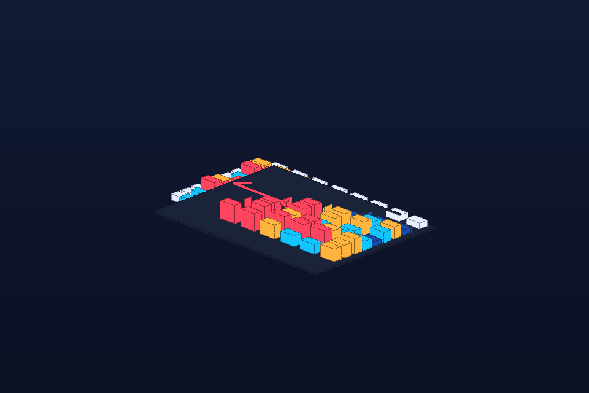

# Transformer Attention Map

- **Category:** LLM interpretability
- **Purpose:** Visualize an attention matrix as raised cells, with token rails and a highlighted focus region for interpretability discussions.
- **Starter prompt:** Render a transformer attention head as a 3D matrix, showing diagonal attention and one strong cross-token focus area.

## Files

- `scene.obj` — reusable geometry scene.
- `scene.mtl` — material color/roughness hints matching the OBJ `usemtl` names.
- `scene.json` — command sequence, camera metadata, pitfalls, and validation checklist.
- `preview.png` — lightweight generated preview for quick review in GitHub/docs.

## MCP tools to use

- `octane_load_recipe`
- `octane_queue_recipe`
- `octane_import_geometry`
- `octane_review_preview`

## Steps

1. Normalize attention weights to 0..1 before geometry generation.
2. Map weight to both height and material color.
3. Add token rails on row/column axes so the matrix remains interpretable.
4. Use preview QA to catch tiny or clipped matrices before native rendering.

## Variations to explore

- Compare attention heads as side-by-side panels.
- Animate layer progression across frames.
- Use saliency, attribution, or confusion matrices with the same matrix grammar.

## Known pitfalls

- Attention matrices get dense quickly; aggregate tokens or heads before rendering large models.
- Height and color together can exaggerate small numeric differences; document normalization.
- Token labels are symbolic rails for now; combine with text-label geometry when exact readable labels are needed.

## Quality checklist

- Preview is non-blank and the central idea is recognizable at thumbnail size.
- Scene imports the local scene.obj path listed in commands[].
- Camera frames the entire subject with margin.
- Materials named in OBJ usemtl statements are documented in scene.mtl and scene.json.
- Native Octane output must be saved as octane-preview.png before claiming native render success.

## Re-render in Octane

1. Load or queue this recipe with `octane_load_recipe("transformer-attention-map")` or `octane_queue_recipe("transformer-attention-map")`.
2. Run the one-shot bridge or an on-demand managed persistent bridge action in Octane X.
3. Save an Octane preview and inspect it with `octane_review_preview` before claiming native success.
