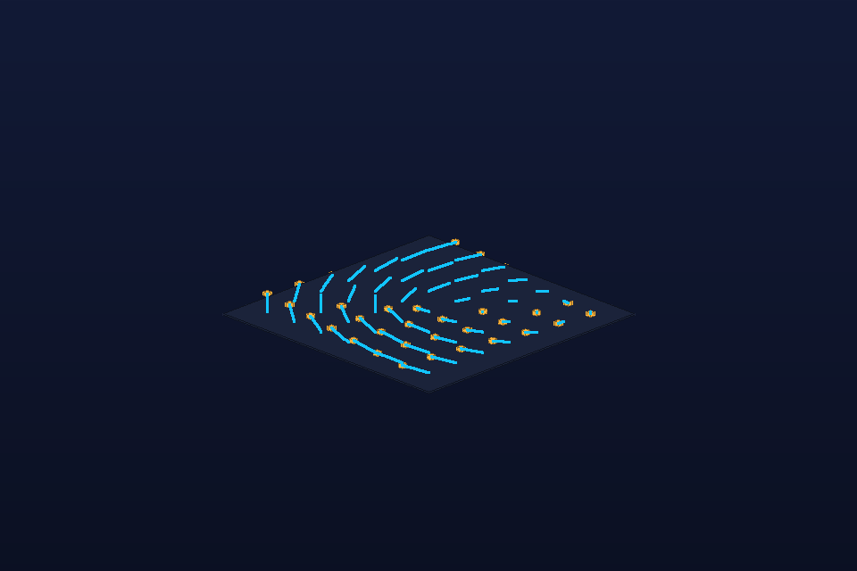

# Rotating Vector Field

- **Category:** Math/physics
- **Purpose:** Show a 2D rotational vector field lifted into 3D with arrow tips to explain flow direction.
- **Starter prompt:** Render a rotational field around the origin for a dynamics lesson.

## Files

- `scene.obj` — reusable geometry scene.
- `scene.mtl` — material color/roughness hints matching the OBJ `usemtl` names.
- `scene.json` — command sequence and camera metadata for agents.
- `preview.png` — lightweight generated preview for quick review in GitHub/docs.

## MCP tools to use

- `octane_import_geometry`
- `octane_create_material`
- `octane_set_camera`

## Steps

1. Generate arrows as line segments plus small cubes/cones.
2. Import geometry and assign bright cyan/gold materials.
3. Frame from above to emphasize vector direction.

## Variations to explore

- Use colors for magnitude.
- Animate successive field snapshots as separate OBJ imports.

## Quality checklist

- Preview is non-blank and recognizable at thumbnail size.
- Camera frames the entire subject with clear margins.
- Materials in `scene.obj` match `scene.mtl` and `scene.json`.
- If Octane drops OBJ line primitives, convert paths/arrows to thin cylinders or tubes for final native renders.
- Record any useful native-render success or failure in `docs/recipe-book.md`.

## Re-render in Octane

1. Import `scene.obj` with `octane_import_geometry(path="examples/recipes/vector-field/scene.obj", name="vector-field")`.
2. Apply camera from `scene.json`.
3. Drain the queue once with `octane_lua/hermes_bridge_oneshot.generated.lua`, then poll `queue/` to zero.
4. Save an Octane preview and replace/add it alongside `preview.png` if it teaches a useful lesson.
