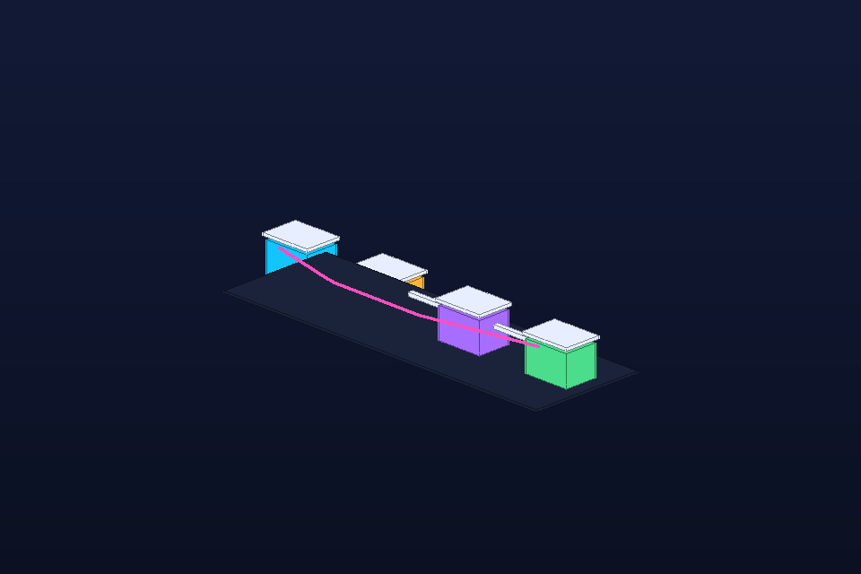

# Render/Vision Feedback Loop

- **Category:** Agent workflow
- **Purpose:** Represent the closed loop where an agent queues geometry, Octane saves a PNG, local vision reviews it, and the next scene patch is chosen.
- **Starter prompt:** Show the OctaneX MCP visual feedback loop as spatial process blocks.

## Files

- `scene.obj` — reusable geometry scene.
- `scene.mtl` — material color/roughness hints matching the OBJ `usemtl` names.
- `scene.json` — command sequence and camera metadata for agents.
- `preview.png` — lightweight generated preview for quick review in GitHub/docs.

## MCP tools to use

- `octane_build_scene`
- `octane_save_preview`
- `octane_review_preview`
- `octane_suggest_camera_fix`

## Steps

1. Build or import scene geometry with the MCP tools.
2. Run the bridge and call octane_save_preview so Octane writes a PNG.
3. Call octane_review_preview and feed warnings into the next camera/material patch.

## Variations to explore

- Use block color to show pass/fail state.
- Animate the magenta return path as a correction pulse in future frame-sequence examples.

## Quality checklist

- Preview is non-blank and recognizable at thumbnail size.
- Camera frames the entire subject with clear margins.
- Materials in `scene.obj` match `scene.mtl` and `scene.json`.
- If Octane drops OBJ line primitives, convert paths/arrows to thin cylinders or tubes for final native renders.
- Record any useful native-render success or failure in `docs/recipe-book.md`.

## Re-render in Octane

1. Import `scene.obj` with `octane_import_geometry(path="examples/recipes/vision-feedback-loop/scene.obj", name="vision-feedback-loop")`.
2. Apply camera from `scene.json`.
3. Drain the queue with `octane_lua/hermes_bridge_oneshot_v2.lua`.
4. Save an Octane preview and replace/add it alongside `preview.png` if it teaches a useful lesson.
